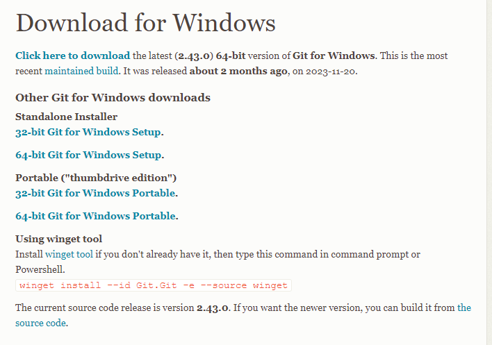
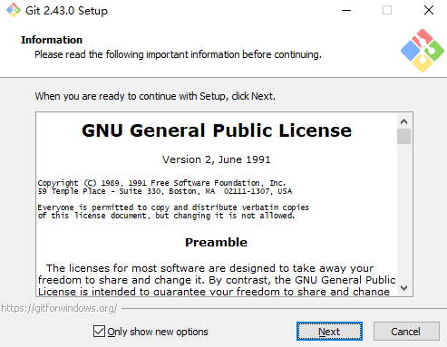
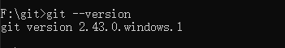
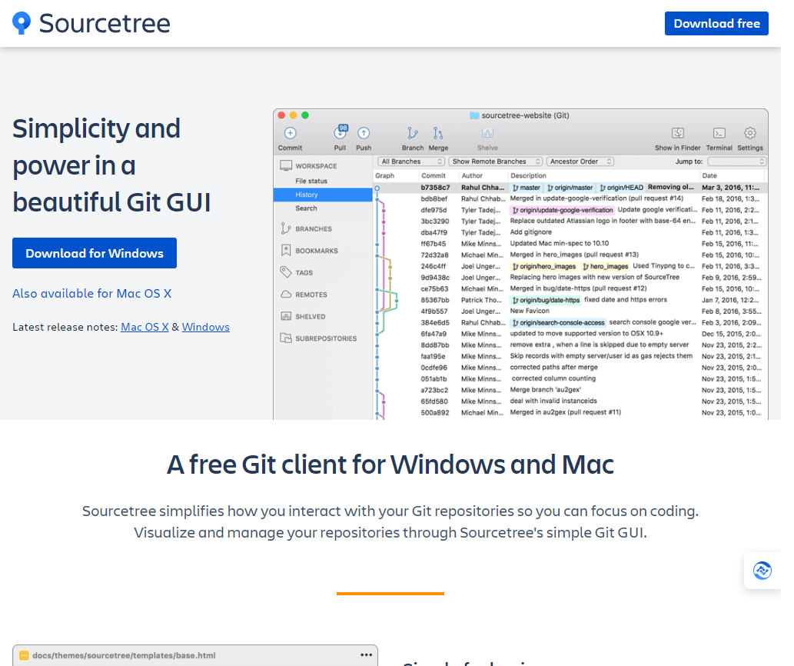
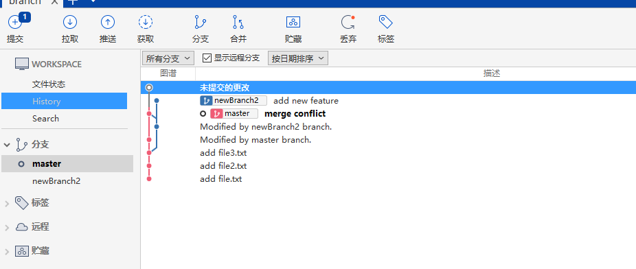
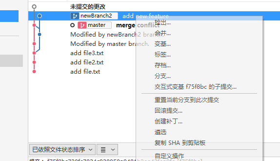

# git 的安装

在我们开始使用 Git 前，需要将它安装在我们的电脑上。即便已经安装，最好将它升级到最新的版本。 我们可以通过软件包或者其它安装程序来安装，或者下载源码编译安装。

本文只介绍通过在 windows 上安装软件包的方式，其他方式请在网上查找。

## 安装

在[官方网站](https://git-scm.com/download/win)上下载对应版本。

下载好后我们进行安装：

安装好后我们在命令行输入 git --version 查看 git 是否安装成功：

##  [SourceTree](https://www.sourcetreeapp.com/)的安装

这是一套非常专业的 GUI 操作工具，不仅支持 Git 版本控制，同时也支持 Mercurial 版本控制机制，这两套版本控制机制都属于分布式版本控制的分类，概念上也十分相近，所以可以整合在这一套工具上使用。

几乎所有的指令列功能都能够过 SourceTree 的 GUI 介面完成(通过鼠标操作)，不过还是老话一句，如果我们对 Git 的核心观念不太了解，再多的右键选单对我们来说等同于白纸一张，一样不知道怎样操作。但我们若认真的了解 Git 的运作机制与观念，使用 SourceTree 绝对能够事半功倍。

进入官网后直接点击按钮下载。

在上图我们可以看到 sourceTree 会把我们 git 仓库上的所有操作以图谱的形式展示出来，可以让我们非常直观的了解到仓库的历史信息，同时还可以通过右键直接进行 checkout 、 merge 等操作。

不过要学会使用 Git 的 GUI 界面工具，一定要先拥有完整的 Git 版控概念，否则真的很难灵活运用这些好用的工具。