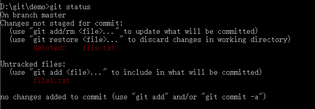

# Git 基础指令

本章涵盖了我们在使用 Git 完成各种操作时将会用到的各种基本命令。 在学习完本章之后，我们应该能够配置并初始化一个仓库（repository）、开始或停止跟踪（track）文件、暂存（stage）或提交（commit）更改。

## 获取 Git 仓库

通常有两种获取 Git 项目仓库的方式：

1. 将尚未进行版本控制的本地目录转换为 Git 仓库。
2. 从其它服务器 clone 一个已存在的 Git 仓库。


### 在本地目录初始化 Git 仓库

直接在需要进行版本控制的文件夹中执行 git init 命令。

该命令将创建一个名为 .git 的子目录，这个子目录含有我们初始化的 Git 仓库中所有的必须文件，这些文件是 Git 仓库的核心。 但是，在这个时候，我们仅仅是做了一个初始化的操作，我们的项目里的文件还没有被跟踪。

### clone 现有的仓库

如果我们想获得一份已经存在了的 Git 仓库的拷贝，比如说，我们想为某个开源项目贡献自己的一份力，这时就要用到 git clone 命令。

Git 克隆的是该 Git 仓库服务器上的几乎所有数据，而不是仅仅复制完成我们的工作所需要文件。 当我们执行 git clone 命令的时候，默认会将远程 Git 仓库中的每一个文件的每一个版本都将被拉取下来。

克隆仓库的命令是 git clone \<url> 。 比如，要克隆 react，可以用下面的命令：

```shell
git clone https://github.com/facebook/react.git
```

这个命令会在当前目录下创建一个名为 react 的目录，并在这个目录下初始化一个 .git 文件夹， 从远程仓库拉取下所有数据放入 .git 文件夹，然后从中读取最新版本的文件的拷贝。 如果我们进入到这个新建的 react 文件夹，我们会发现所有的项目文件已经在里面了，准备就绪等待后续的开发和使用。

如果我们想在克隆远程仓库的时候，自定义本地仓库的名字，我们可以通过额外的参数指定新的目录名

```shell
git clone https://github.com/facebook/react.git localReact
```

这会执行与上一条命令相同的操作，但目标目录名变为了 localReact。


## 跟踪新文件

使用命令 git add 开始跟踪一个文件。

在「工作目录」里新增一个 file.txt 文件，通过 git status 查看信息可以看到在 Untracked files 这行下面存在一个 file.txt 文件未追踪。


执行 git add file.txt 追踪文件。


只要在 Changes to be committed 这行下面的，就说明是已暂存状态。 如果此时提交，那么该文件在我们运行 git add 时的版本将被留存在后续的历史记录中。 

git add 后可携带参数：
- .：追踪「工作目录」中所有的文件
- 目录路径：递归地跟踪该目录下的所有文件
- 文件名：追踪当前文件

## 暂存已修改的文件

修改一个已被跟踪的文件后使用 git status 查看信息：


当执行 git status 命令后，Changes not staged for commit 这行下面存在文件信息，说明这些已追踪文件的内容发生了变化，但还没有放到「暂存区」。要暂存这次更新，需要重新运行 git add 命令。


现在最新内容已暂存，下次提交时就会记录到仓库。

## 状态预览

前面已经使用到了 git status 命令但是没进行解释，现在便介绍一下这个指令。

这个指令就是用于比对「暂存区」与「工作目录」中的文件，之后将一些差异文件标记出来。

git status 命令的输出十分详细，但其用语有些繁琐。 Git 有一个选项可以帮我们缩短状态命令的输出，这样可以以简洁的方式查看更改。 如果我们使用 git status -s 命令或 git status --short 命令，我们将得到一种格式更为紧凑的输出。


新添加的未跟踪文件（file5.txt）前面有 ?? 标记，新添加到暂存区中的文件（file4.txt）前面有 A 标记，修改过的文件前面有 M 标记。输出中有两栏，左栏指明了暂存区的状态，右栏指明了工作区的状态。例如，上面的状态打印显示：file.txt 文件在「工作目录」已修改但尚未暂存；file2.txt文件已修改且已暂存; file3.txt 文件已修改，暂存后又作了修改，因此该文件的修改中既有已暂存的部分，又有未暂存的部分。

## 忽略文件

一般我们总会有些文件无需纳入 Git 的管理，也不希望它们总出现在未跟踪文件列表。 通常都是些自动生成的文件，比如日志文件，或者编译过程中创建的临时文件等。 在这种情况下，我们可以在「工作目录」的根目录下创建一个名为 .gitignore 的文件，列出要忽略的文件的模式。

.gitignore 文件的格式规范如下：
- 所有空行或者以 # 开头的行都会被 Git 忽略。
- 可以使用标准的 glob 模式匹配，它会递归地应用在整个工作区中。
- 匹配模式可以以（/）开头防止递归。
- 匹配模式可以以（/）结尾指定目录。
- 要忽略指定模式以外的文件或目录，可以在模式前加上叹号（!）取反。

所谓的 glob 模式是指 shell 所使用的简化了的正则表达式。 星号（*）匹配零个或多个任意字符；[abc] 匹配任何一个列在方括号中的字符 （这个例子要么匹配一个 a，要么匹配一个 b，要么匹配一个 c）； 问号（?）只匹配一个任意字符；如果在方括号中使用短划线分隔两个字符， 表示所有在这两个字符范围内的都可以匹配（比如 [0-9] 表示匹配所有 0 到 9 的数字）。 使用两个星号（\*\*）表示匹配任意中间目录，比如 a/**/z 可以匹配 a/z 、 a/b/z 或 a/b/c/z 等。

我们来看一个 .gitignore 文件的例子：

```
# 忽略所有的 .a 后缀文件
*.a

# 但跟踪所有的 lib.a，即便我们在前面忽略了 .a 后缀文件
!lib.a

# 只忽略当前目录下的 TODO 文件，而不忽略 xxx/TODO
/TODO

# 忽略任何目录下名为 build 的文件夹
build/

# 忽略 doc/xxx.txt，但不忽略 doc/xxx/xxx.txt
doc/*.txt

# 忽略 doc/ 目录及其所有子目录下的 .pdf 后缀文件
doc/**/*.pdf
```

## 提交更新

在每次提交前，先用 git status 看下，我们所需要的文件是不是都已暂存起来了， 然后再运行提交命令 git commit：

这样会启动我们选择的文本编辑器来输入提交说明。

> 启动的编辑器是通过 Shell 的环境变量 EDITOR 指定的，一般为 vim 或 emacs。当然也可以使用 git config --global core.editor 命令设置我们喜欢的编辑器。

### 使用 vim 编辑器

我们以 vim 为例介绍如何编写提交信息，当我们直接输入 git commit 命令时，就会进入到 vim 编辑器，然后去编写相关的提交信息。


- 按下字母键 i 或 a 或 o，此时进入到可编辑状态，这时就可以输入我们的注释
- 当我们输入完之后，按下 Esc 键就可退出编辑状态，回到一般模式。

最后就是怎么退出 vim 编辑器并提交 commit， 有两种方法：
- 输入两字大写字母 ZZ（记住是大写）
- 输入 :wq 或 :wq! (强行退出)

### 使用 -m 参数

另外，我们也可以在 commit 命令后添加 -m 参数，将提交信息与命令放在同一行


可以看到，提交后它会告诉我们，当前是在哪个分支（master）提交的，本次提交的 hash 值是什么（925ab48），以及在本次提交中，有多少文件修订过，多少行添加和删改过。

> 提交时记录的是放在「暂存区」的快照。 任何还未暂存文件的仍然保持已修改状态，可以在下次提交时纳入版本管理。 每一次运行提交操作，都是对我们项目作一次快照，以后可以回到这个状态，或者进行比较。

我们可以携带两个 -m 参数，第一个 -m 后携带的是作为本次 commit 的标题，第二个则是 commit 的消息：


### 跳过 git add 命令

尽管使用「暂存区」的方式可以精心准备要提交的细节，但有时候这么做略显繁琐。 Git 提供了一个跳过使用「暂存区」的方式， 只要在提交的时候，给 git commit 加上 -a 选项，Git 就会自动把所有**已跟踪**过的文件暂存起来一并提交，从而跳过 git add 步骤。


提交之前不再需要 git add file6.txt 了。 这是因为 -a 选项使本次提交包含了所有修改过的文件。 这很方便，但是要小心，有时这个选项会将不需要的文件添加到提交中。

## 移除文件

如果我们想要删除某个已追踪的文件，如果我们直接从「工作目录」中删除，那么还需要直接 git add 命令把这个删除操作提交到「暂存区」里，删除掉「暂存区」中的文件。


在 Git 指令列工具中有个 rm 指令，可以用来删除文件（可以同时删除「暂存区」和「工作目录」中的文件），下一次提交时，该文件就不再纳入版本管理了。 


如果要删除之前修改过或已经放到「暂存区」的修改后的文件，则必须使用强制删除选项 -f。 这是一种安全特性，用于防止误删尚未添加到快照的数据，这样的数据不能被 Git 恢复。

如果我们只是想要把文件从 Git 仓库中删除（从「暂存区」删除），但是依旧保留在「工作目录」中，可以使用 --cached 参数。


可以看到 file.txt 被「暂存区」删除了，这个文件此时处于未追踪的状态。

## 文件重命名

Git 并不显式跟踪文件移动操作。 如果在 Git 中重命名了某个文件，仓库中存储的元数据并不会体现出这是一次改名操作。

如果我们直接在「工作目录」中修改某个已追踪的文件名，此时通过 git status 查看状态



可以发现 Git 在比对之后发现 file.txt 文件被移除了，反而多了一个 file1.txt 文件，如果我们想要提交这次操作就需要执行 git add 命令：


如此分开操作，Git 也会意识到这是一次重命名，因此可以看到状态中有一个 renamed 关键词。

在 Git 指令列工具中有个 mv 指令，可以用来变更文件或目录的名称。可以避免上述的多条指令操作：


## 查看提交历史

在提交了若干更新，又或者克隆了某个项目之后，我们想回顾一下项目提交历史，可以通过 git log 命令来查看。


不传入任何参数的默认情况下，git log 会按时间先后顺序列出所有的提交，最近的更新排在最上面。 正如我们所看到的，这个命令会列出每个 commit 的 hash 值和、作者的名字和电子邮件地址、提交时间以及提交说明。

有时候记录越来越多，我们也可以通过以下指令限制输出的版本数量，我们只要通过一个減号 (-) 与一个数字，就可以限定输出最近几条记录：


## 撤销操作

### 撤销「暂存区」中的文件修改

当我们修改了某个文件并放入了「暂存区」，但是后来我们发现这个修改会导致问题，想取消暂存时，可以使用 git reset HEAD \<filename> 命令来取消暂存文件。


从上图可以看到执行撤销命令后，文件又恢复成未放入暂存区的状态了。

### 撤销「工作目录」的文件修改

如果我们在「工作目录」修改了某个文件，但是这个需求被砍了，我们需要恢复成原来的版本（上一次 commit 的版本），可以使用 git checkout -- \<filename> 命令。


### 重新提交

有时候我们提交完了才发现漏掉了几个文件没有添加，或者提交信息写错了。 此时，可以运行带有 --amend 选项的提交命令来重新提交：

这个命令会将「暂存区」中的文件提交。 如果自上次提交以来我们还未做任何修改（例如，在上次提交后马上执行了此命令）， 那么快照会保持不变，而我们所修改的只是提交信息。


最终我们只会有一个提交——第二次提交将代替第一次提交的结果。

> 当我们在修补最后的提交时，与其说是修复旧提交，倒不如说是完全用一个 新的提交 替换旧的提交， 理解这一点非常重要。从效果上来说，就像是旧有的提交从未存在过一样，它并不会出现在仓库的历史中。


## 标签

### 查看所有标签

在 Git 中列出已有的标签非常简单，只需要输入 git tag （可带上可选的 -l 选项 --list）：


这个命令以字母顺序列出标签，但是它们显示的顺序并不重要。

### 创建标签

Git 支持两种标签：轻量标签（lightweight）与附注标签（annotated）。

现在我们只介绍一下轻量标签。

创建轻量标签，只需要提供标签名字：


### 推送到远程仓库

默认情况下，git push 命令并不会传送标签到远程仓库服务器上。 在创建完标签后我们必须显式地推送标签到共享服务器上。我们可以运行 git push origin \<tagName>。

### 删除标签

要删除掉我们本地仓库上的标签，可以使用命令 git tag -d \<tagName>

跟新增标签一样，我们需要额外的命令告知远程仓库删除标签 git push origin --delete \<tagName>

