# git 中的概念

在使用 Git 版本控制的过程中，有些概念我们必须有所了解，这样才能更有效率也更有意义的学下去。

有清楚且正确的概念认知，不但有助于我们学习如何操作 Git 命令，更重要的是，学习 Git 的相关知识也会更加容易上手。

本文的一些概念都是使用 英文 为主，这是因为在不同文章里可能会存在一些翻译问题，会导致大家有一些理解误差。

## repository

我们更多的将其翻译为「仓库」， 我们要使用 Git 进行版本控制，很自然的，我们需要一个「仓库」来储存这些版本信息，这个仓库其实就是用来储存所有版本的一个空间或一个文件夹与一堆文件。

如果有了解过 Git 的人，应该很清楚，建立仓库有很多方法，如果我们要在任意一个文件夹里建立一个 Git 仓库，只要输入以下命令就可以建立完成：

```shell
git init
```

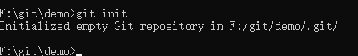

从上图可以看到，我们在执行了 git init 命令后在 demo 目录下创建了 .git 目录，这个文件夹就是一个 Git 仓库，未来所有版本的变更，都会自动储存在这个文件夹里面。

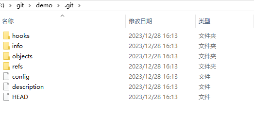

## working directory

「工作目录」

在上面我们执行了 git init 命令后，这个 demo 文件夹就会自动成为我们的「工作目录」。

所谓「工作目录」的意思，就是我们正在准备开发的项目文件，未来都会在这个目录下进行编辑，无论是新增文件、修改文件、删除文件、文件更名以及所有其他 Git 相关的操作，都会在这个目录下完成，所以才称为「工作目录」。

由于在使用 Git 版本控制时，会遭遇到很多分支的状況，所以「工作目录」很有可能会在不同的分支之间进行切换，有些 Git 指令在执行的时候，会一并更新「工作目录」下的文件。例如当我们使用 git checkout 切换到不同分支时，由于目前分支与想要切换过去的分支的目录结构不太一样，所以很有可能会将我们目前「工作目录」下的文件进行更新，好让目前的「工作目录」下的这些目录与文件，都与另一个要切换过去的分支下的目录与文件一样。

所以，适时的保持「工作目录」的干净，是版本控制过程中的一个基本原则，更尤其是日后要进行合并的时候，这点尤其重要。

## staging area

「暂存区」，由于在 git 仓库中「暂存区」其实是一个名为 index 的文件（ .git/index ），所以也会被叫做「索引」。

「工作目录」下的每一个文件都只有一种状态：**已跟踪** 或 **未跟踪**。 

已跟踪的文件是指那些被纳入了版本控制的文件，「工作目录」中除已跟踪文件外的其它所有文件都属于未跟踪文件，它们既不存在于上次快照的记录中，也没有被放入「暂存区」。简而言之，已跟踪的文件就是 Git 已经知道的文件。

在「工作目录」中新增一个文件，这个文件就是未追踪的。

比如我们在「工作目录」中新增一个 index.js 文件。


通过 git status 查看状态

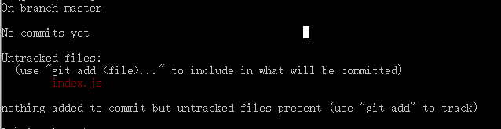

这里提示了「工作目录」里存在一个未追踪的文件 index.js.

此时我们可以通过 git add index.js 把 index.js 文件添加进「暂存区」中，在运行 git status 命令，会看到 index.js 文件已被追踪，并处于暂存状态：

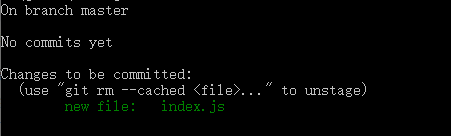

只要在 Changes to be committed 这行下面的，就说明是已暂存状态。 如果此时执行 git commit 命令，那么该文件在我们执行 git add 时的版本将被留存在后续的历史记录中。 

修改 index.js 文件的内容后我们再执行 git status 看看状态。

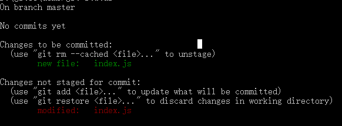

index.js 文件出现在「暂存区」和非暂存区了，这是因为我们执行 git add 命令后只是把当前版本（文件内容变更后都属于一个新版本）添加进「暂存区」。

如果我们执行 git commit 命令把版本提交出去，版本库中 index.js 的版本就是我们最后一次执行 git add 命令时的那个版本，而不是当前「工作目录」中最新的版本。所以，运行了 git add 之后又作了更改的文件，需要重新运行 git add 把最新版本重新暂存起来。

上图中文件 index.js 出现在 Changes not staged for commit 这行下面，说明已跟踪文件的内容发生了变化，但还没有放到「暂存区」。 要暂存这次更新，就需要再次运行 git add 命令。 

「暂存区」的目的主要用来记录「有哪些文件即将要被提交到下一个 commit 版本中」。如果我们想把某个版本提交到 Git 仓库里，那么我们首先就要把这个文件放入「暂存区」中，之后才能将这个变更版本提交出去。

对于已追踪的文件，在工作一段时间后，它们的状态可能是 unmodified、modified 或 staged。

- unmodified：未修改的，代表文件第一次被加入，或是文件内容与最后一次 commit 的版本一致的状态。
- modified：已修改的，代表文件已经被编辑过，或是文件内容与最后一次 commit 的版本不一致的状态。
- staged：等待被 commit 的，代表下次执行 git commit 会将这些文件全部纳入版本库。


### git add 命令
git add 指令，是为了将目前「工作目录」的变更写入到「暂存区」里。

> 使用 git add -u 则可以仅将「更新」或「删除」的文件变更写入到「暂存区」中。

git add 命令是一个多功能命令，可以：
- 开始追踪新文件
- 把修改后的已追踪文件放到「暂存区」
- 用于合并时把有冲突的文件标记为已解决状态等


### git status 命令

主要用来获取 「工作目录」中的文件的最新版本与「暂存区」中的差异。

这些差异中一共有三种不同的分组：
- Changes to be committed (准备提交的变更)：通过 git add 命令添加到「暂存区」中但是暂时未被提交到版本库中的文件
- - 新文件：版本库中不存在该文件，但是「暂存区」存在该文件，前面会有一个 new file 的提示
- - 修改后的文件：版本库中存在该文件，但是版本库中的最新版本与「暂存区」版本不一致，前面会有一个 modified 的提示。
- - 在执行 git commit 后这些文件都会被提交到版本库中。
- Changes not staged for commit (尚未准备提交的变更)：暂时未通过 git add 命令将变更版本放入「暂存区」的文件
- - 修改后的文件：版本库或者「暂存区」中存在该文件，但是版本库或者「暂存区」中的最新版本与「工作目录」中的最新版本不一致，前面会有一个 modified 的提示。
- - 在执行 git commit 后这些变更文件**并不会被**添加到版本库中。
- Untracked files (未追踪的变更)：
- - 新文件：版本库中不存在，暂存区也不存在。
- - 在执行 git commit 后这些变更文件**并不会被**添加到版本库中。


## objects

对象，Git 的对象分为以下四种类型：
- 「blob 对象」：「暂存区」的具体文件内容
- 「tree 对象」：包含「暂存区」的文件的文件夹名及对应的「blob 对象」
- 「commit 对象」：提交的 commit 信息及 tree（root tree） 对象
- 「tag 对象」：对应的 commit 对象的 hash 值

上面的几种类型不需要强行硬背，阅读完下面的部分想必大家都能轻易理解。

我们在执行 git init 后，.git/objects 文件夹里只存在 info、pack 两个空文件。

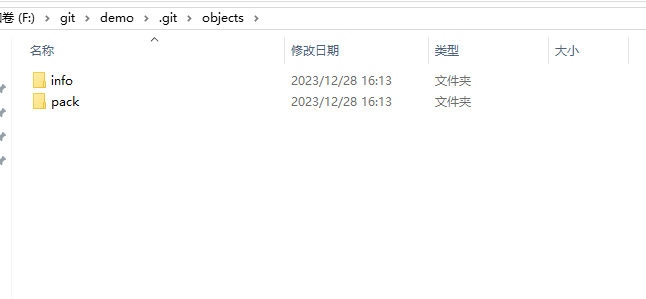

当我们在根目录下输出下面的命令创建一个 file1.txt 文件，并输入 hello git; 作为内容。

```shell
echo hello git; > file1.txt
```

然后执行 git add . 命令将 file1.txt 文件放入暂存区：

```shell
git add .
```

此时我们看看 objects 文件夹中多了个名为 76 的文件夹


该文件夹里的存在一个 31bcb57512d5989050a08d7c507c8db7eebf8f 文件

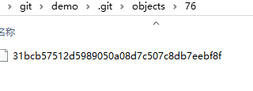

我们在通过 git add 命令将文件存入「暂存区」时，都会将文件的内容中取出，通过内容产生一组 SHA1 哈希值，然后依照这个 SHA1 哈希值命名一个文件并放入 objects 文件夹中。**这个文件就是 「blob 对象」**。

Git 仓库中的每一个「对象」，都是以「文件内容」进行 SHA1 哈希运算出一个 hash 值，并用这个 hash 值当作对象的名称 (文件名)。我们以 7631bcb57512d5989050a08d7c507c8db7eebf8f 为例，Git 会先拿前两个字元(92)当作目录名，然后把剩下的 hash 值当成文件名 (31bcb57512d5989050a08d7c507c8db7eebf8f)，这些对象的实体目录与文件也都是放在 .git\objects 目录下。

此时我们打开这个文件，可以发现里边是乱码，这是因为文件内容都是通过 zlib 算法进行压缩过的，这样不但可以有效的提升文件存取效率，在日后进行封装(pack)的时候也可以利用差异压缩(delta compression)演算法来节省空间。他会自动找出相似的 blobs，并自动计算出 blob 之间的变化差异，再将这些差异储存在一个名为 packfile 的文件中，这样就可以大幅节省磁盘空间的耗用)。

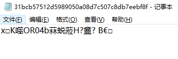


### 使用 node 解压

如果我们想读取里边的内容，可以使用 node 中的 zlib 库进行解压。

```js
const zlib = require("zlib");
const fs = require("fs");
const path = require("path");

const file = fs.readFileSync(path.resolve(__dirname, "./31bcb57512d5989050a08d7c507c8db7eebf8f"));
zlib.unzip(file, function (err, buffer) {
  if (!err) {
    console.log(buffer.toString());
  }
});
```
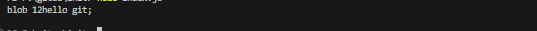

可以看到解压出来的内容并非原来的文本内容，而是多了 blob 12 这几个字符（ Git 的处理），其中 blob 就是标识这个文件类型，12 就是文件的大小。

### 使用 git cat-file 指令读取

Git 也提供了一个命令来读取这些对象的内容：

```shell
git cat-file -p [hashname]
```

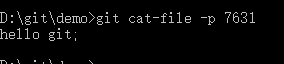

此时读取的文件内容是不包含类型及文件大小的，我们可以使用 -t 标识来读取这个文件对象类型：

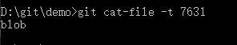

使用 -s 标识来读取文件大小：


在把文件放入「暂存区」后，我们通过 commit 命令进行提交：

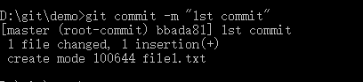

解析一下上面的信息：
- master：当前 commit 的分支
- root-commit：当前分支的首次 commit，第二次的 commit 会以此作为 parent 来构建链式 commit，实现版本回退。
- bbada81：当前 commit 的 hash 值，我们可以通过这个 hash 来获取到对应 「commit 对象」的信息
- 1st commit：当前 commit 的信息
- 1 file changed, 1 insertion(+)：当前 commit 版本与之前版本对比后的文件变动描述
- create mode 10064 file1.txt：新增了一个 10064 权限的文件，文件名为 file1.txt。（10064就是 Git 内部的文件权限标识，代表普通文件，可读可写。）

此时在 objects 文件夹上新增了一个 bb 文件夹，这个文件里有两个文件。

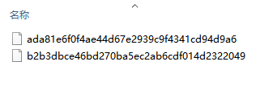

通过上面的 commit 消息可以看到 bbada81 开头的就是「commit 对象」，也就是 ada81... 这个文件。

通过 git cat-file 看看这个文件对象类型及内容：


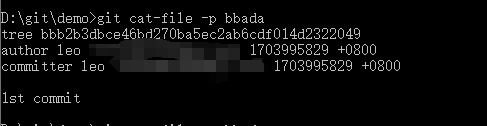

可以看到在「commit 对象」里存在以下信息：
- tree bbb2b3dbc...： 这个就是「tree 对象」，我们可以把它理解成目录，用于 Git 在版本库里组织文件结构，这样就可以保证跟「工作目录」里的结构是一样的。
- author：仓库作者信息
- committer：当前 commit 的作者信息
- 1st commit：当前 commit 的信息

在 objects 文件夹中也存在一个 bb/b2b3dbc... 文件。

通过 git cat-file 看看「tree 对象」类型及内容：


在上图中可以看到这个「tree 对象」里包含了一个「blob 对象」的索引以及文件名，这个「tree 对象」就相当于「工作目录」的根目录，根目录下存在一个 file1.txt 文件（也就是「blob 对象」），这样一个「commit 对象」其实就对应了当前提交的「工作目录」的版本。

为了更好的理解「tree 对象」，我们在「工作目录」创建一个 folder1 文件夹

执行 git status 查看状态时会发现提示 nothing to commit，这是因为 Git 是以文件内容进行对比的，文件夹并不会纳入对比。

在 folder1 文件夹下新建一个 file2.txt 文件，内容依旧是 hello git;。此时通过 git status 就可以看到 Git 检测到了「工作目录」存在未追踪的文件。

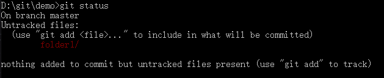

通过 git add . 把文件放入「暂存区」后，由于 file2.txt 与 file1.txt 的内容是相同的（hash 值也一样），因此在 objects 文件夹中并不会生成新的「blob 对象」，之后我们把文件提交出去。

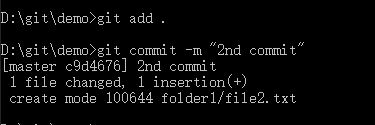

此时在 objects 目录下生成了3个文件夹：02、55、c9（根据上图的 commit 信息可知，c9 文件夹里的 d4676... 文件就是「commit 对象」）。

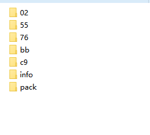

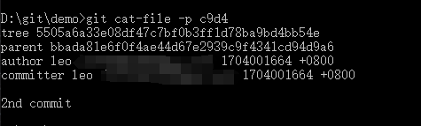

解析一下上图中「commit 对象」：
- tree 5505...：「tree 对象」，前面说过可以把它理解成一个目录，在这里我们把它认为是根目录，就是当前代码版本的根目录。
- parent bbada...：记录上一次 commit 的 hash 值，这样就通过 git reset HEAD^ 回退到上一次的版本。 

通过 cat-file 查看一下 5505... 这个「tree 对象」的内容：

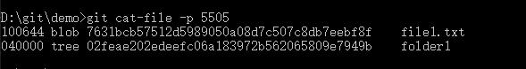


里面有一个「blob 对象」hash值、名称，以及一个「tree 对象」hash值、名称，我们现在盲猜都可以知道 02fe... 这个「tree 对象」里边的内容就是 file2.txt 文件对应的「blob 对象」hash值、名称。


整理一下当前的「commit 对象」，可以看到跟我们「工作目录」的结构是一样的。

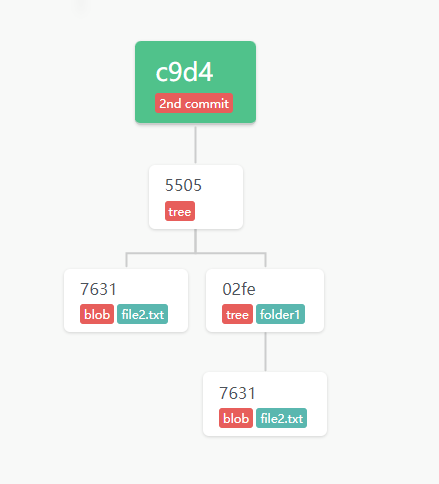

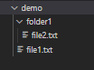

此时 objects 中各对象的引用关系如下图所示：

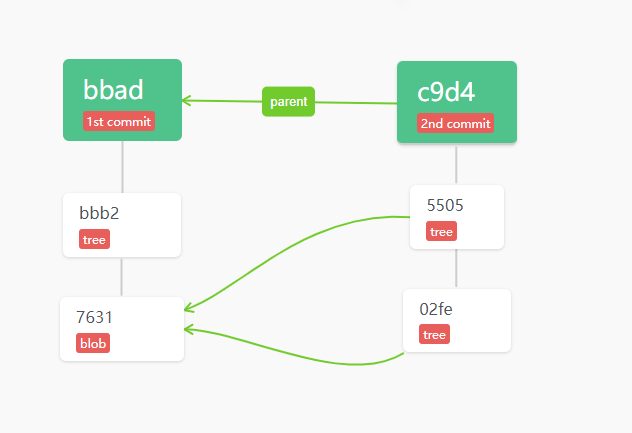


对于 blob、tree、commit 这三个对象，我们应该都非常理解了吧，还剩最后一个「tag 对象」，这个文件在 .git/refs/tag 文件夹中，文件名就是 tag 名，文件内容就是在生成 tag 时 commit 的 hash 值。

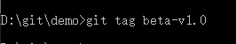

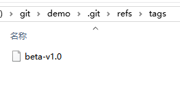

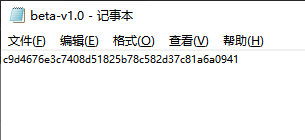

这四个对象的关系如下：


