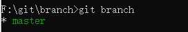
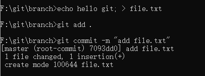
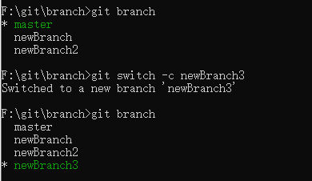
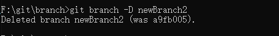
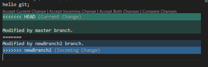

# git 中分支的概念及使用

分支模型是 Git 中的 “必杀技特性”， Git 处理分支的方式非常轻量，创建新分支这一操作几乎能在瞬间完成，并且在不同分支之间的切换操作也是一样便捷。 理解和精通这一特性，我们便会意识到 Git 是如此的强大而又独特，并且从此真正改变我们的开发方式。

在版本控制中使用「分支」，最主要的目的就是用来解决开发过程中版本冲突的问题。

## 概念

在 Git 中保存的不是文件的变化或者差异，而是一系列不同时刻的快照。Git 的分支就是某个「commit 对象」的 hash 值（也就是一个指针）。


我们可以在 .git/refs/heads 文件夹中看到存在两个 master 、newBranch 两个文件：


这些文件里面的内容就是分支对应的最新「commit 对象」的 hash 值：


### HEAD

HEAD 也是一个指针，指向当前我们「工作目录」分支最新「commit 对象」的 hash 值。


我们在执行 git log 命令时也会显示这个 HEAD：


在这里提示了当前处于 master 分支，且最新的「commit 对象」的 hash 值是d49f35...。

HEAD 指针保存在 .git/HEAD 文件中，我们可以直接打开该文件查看内容：


可以看到文件内容是 refs/heads/master，根据前面讲解的可以知道 master 文件里的内容是最新的「commit 对象」的 hash 值，所以我们现在应该清楚为什么 HEAD 能指向当前「工作目录」分支最新「commit 对象」的 hash 值了吧。

当我们执行 git checkout newBranch 命令时 HEAD 文件里的内容就会更改成对应的 newBranch 分支映射：


同时 git log 命令里显示的内容也不一样，HEAD 指向了 newBranch：


### 日志记录

当我们创建了新分支后，在 .git/logs/refs/heads 文件中就会生成对应的分支记录文件，里面包含了分支创建时的「commit 对象」hash 值，这样我们就能知道创建分支的源头：


在 newBranch 这个分支文件里面可以看到 newBranch 是在 a71e31... 这个「commit 对象」中创建的。之后的一些 commit 操作也会记录上去。

## 分支创建

我们在初始化 Git 仓库时，默认就创建了一个名叫 master 分支（在 github 中叫 main，只是名称不同，并非存在特别的设计）。



**分支名称前面的 * 代表处于当前分支。**

我们在 master 分支上添加一个 file.txt 文件并提交用于后续的使用。




创建分支有三种方法，分別是：

1. git branch \<branchName>：这个命令可以创建一个分支
   
    

    在上图可以看到通过 git branch 可以查询到当前仓库多了一个 newBranch1 的分支，但是此时「工作目录」还处于 master 分支上，如果我们需要在 newBranch1 分支上开发，需要切换分支（请看 分支切换 部分）。

    此时我们 master 分支上再次新增一个 file2.txt 文件并提交用于后续的使用。

2. git checkout -b \<branchName>：这个命令不但会建立一个新分支，还会将目前「工作目录」切换到新建的分支上。
   
   
   
   从上图可以看到执行命令后不仅多了一个 newBranch2 分支，当前的「工作目录」也处于 newBranch2 分支下（ * newBranch2 ）

   

   根据 git log 命令我们可以看到 newBranch1、newBranch2 的历史提交记录不同，这是因为分支会自动继承来源分支的完整历史（在 newBranch2 分支创建之前 master 又新增了一个 file2.txt 文件）。
3. git switch -c \<branchName>：跟第二种方法一样，不但会建立一个新分支，还会将目前「工作目录」切换到新建的分支上。

   

## 分支切换

### 使用 checkout 

如果我们想将「工作目录」切换到其他分支，可以输入以下指令：

```shell
git checkout [branchName]
```

**与创建分支的第二种方法非常类似（只是不含 -b 参数）。**

切换到 newBranch1


可以看到提交历史里只有一条记录。


在切换分支前，需要确保我们的「工作目录」是干净的（不能有任何文件异动中的状态），否则分支切换会失败，比如我们修改了file.txt文件但是并未提交：


### 使用switch

```shell
git switch [branchName]
```

**与创建分支的第三种方法非常类似（只是不含 -c 参数）。**


使用 -f 参数可以强制切换分支，不过这会导致当前分支上未提交的修改被删除掉，最好慎用。


## 分支删除

如果我们想删除某个分支，可以输入以下指令：

```shell
git branch -d [branchName]
```

**与创建分支的第一种方法非常类似（只是多了个 -d 参数）。**

我们不能删除当前「工作目录」所处的分支，必须先切换到其他分支后，再删除我们目前这个分支。

举个例子，如果我们想删除当下这个 newBranch1 分支，那么我们必须先切换到其他分支（例如 master 分支），然后再执行 git branch -d newBranch1 命令，即可删除 newBranch1 分支。

删除当前分支会提示失败：


切换成 master 分支后删除 newBranch1：


如果我们在分支上提交了，之后在删除该分支时 Git 也会提示错误：


这是因为 Git 检测到了当前分支的提交并没有合并到 master 分支上，我们可以先合并之后再删除，或者使用 -D 参数来强制删除：



## 查看当前分支

直接用 git branch 命令查看所有的分支，分支名称前面存在 * 字符代表处于当前分支。

## 分支合并

由于 Git 是一种分布式版本控制系统，过程中会不断的进行分支与合并，无论是有意的合并 ( git merge ) 或无意的合并 ( git pull )，总之在使用 Git 时「合并」的动作会经常发生。

如果我们想将当前分支的「工作目录」合并到其他分支，需要先切换到需要合并的那个分支上，然后执行 git merge 命令。

继续我们上面的例子，我们现在在 newBranch2 上新建一个 file3.txt 文件后提交。此时 newBranch2 领先 master 分支一个 commit，之后切换成 master 分支，执行 git merge newBranch2 命令即可合并。


此时我们可以看到合并成功后在 master 分支上的「工作目录」也存在了 file3.txt 文件。

通常来说，在执行完合并操作后，分支的任务已经完成了，此时就可以把该分支删除了。

### 遇到冲突时合并

很多时候我们的合并操作并不会像上面的例子一样这么简单，对于多人协同开发，免不了会对同一个文件进行不同的修改，此时合并通常都会产生冲突：


虽然冲突了，但是文件其实已经合并成功，不过冲突文件上会包含一些特殊区段：


从 <<<<<<< HEAD 到 ======= 的内容，代表 file.txt 的内容。**HEAD 代表当前 master 分支的最新版**。

从 ======= 到 >>>>>>> newBranch2 的内容，代表 newBranch2 分支里 file.txt 的内容。

我们通过 git status 查看状态也会有提示：


为了解决冲突，我们必须选择使用由 ======= 分割的两部分中的一个，或者也可以自行合并这些内容（如果我们遇到冲突什么都不改，直接执行 git add . 再加上 git commit 的话，确实也可以解决冲突，但是提交上去的文件仍旧会存在这些特殊区段）。

在这里我们直接合并两个分支的内容，手动把特殊区段去掉：


或者通过 vscode 提供的简便方式直接合并：



也可以通过 git mergetool 命令启动一个可视化合并工具：


解决完冲突后，对每个文件使用 git add 命令来将其标记为冲突已解决。 一旦暂存这些原本有冲突的文件，Git 就会将它们标记为冲突已解决。

### 合并重置

如果我们合并时出错了，这时只需要通过 git reset --hard ORIG_HEAD 命令就可以回复到上一版，然后再重新合并一次引发相同的冲突。


> 在执行 merge 命令时，会在 .git 文件下生成一个 ORIG_HEAD 文件，里面便记录了当前分支在合并前的最新「commit 对象」的 hash 值。

## 分支管理

--merged 与 --no-merged 这两个的选项可以过滤这个列表中已经合并或尚未合并到当前分支的分支。 

如果要查看哪些分支已经合并到当前分支，可以运行 git branch --merged：

在这个列表中分支名字前没有 * 号的分支通常可以使用 git branch -d 删除掉；我们已经将它们的工作整合到了另一个分支，所以并不会失去任何东西。

查看所有包含未合并工作的分支，可以运行 git branch --no-merged：


这里显示了其他分支。 因为它包含了还未合并的工作，尝试使用 git branch -d 命令删除它时就会提示失败。

## 暂存「工作目录」

有时，当我们在项目的一部分上已经工作一段时间后，所有东西都进入了混乱的状态，而这时我们想要切换到另一个分支做一点别的事情或者是拉取远程仓库中的最新代码。但是这时候我们并不想为当前未完成的工作创建一次提交，此时就可以通过 git stash 命令来把「工作目录」暂存起来，使仓库回归到上一次 commit 的版本。

当前在 master 分支上开发着新功能：


执行 git stash 或者 git stash push 保存未完成功能：


现在可以看到当前的「工作目录」是干净的，我们就可以切换到其他分支或者拉取最新的代码了。

可以使用 git stash list 来查看暂存的东西。


使用 git stash apply 便可以重新应用之前的工作，默认是恢复最新（索引为 0 那个）的暂存内容，也可以通过 git stash apply stash@{-n} 来指定恢复某个暂存。


使用 git stash apply 命令只是恢复暂存的内容，但是在暂存堆栈上仍旧存在它，我们可以使用 git stash drop 加上将要移除的暂存的名字来移除它。


当然也可以直接通过 git stash pop 直接恢复暂存内容同时从暂存堆栈上删除掉。

## checkout 命令

我们在切换分支的时候，分支本身其实并没有任何变化，变动的只是 HEAD 这个指针。

前面我们说到，.git/HEAD 这个文件的内容是指向当前分支的（例如，refs/heads/master ），而当前分支文件里储存是最新「commit 对象」的 hash 值，那么本质上 HEAD 其实指向的就是一个「commit 对象」的 hash 值，因此我们也可以直接使用 git checkout \<hashName> 命令直接取出来一个具体的 commit 版本。


可以看到我们在执行了 git checkout 2e77 后出现了一大堆提示，在 git log 命令也可以看到 HEAD 指向了具体的「commit 对象」的 hash 值而非某个分支，这种现象就成为 detached HEAD（分离头指针）。

.git/HEAD 文件里的内容也变成了具体的 hash 值：


在这种情况下，我们执行 add、commit 的操作并不会记录在任何分支上（垃圾对象），如果我们想把这些操作记录起来就需要执行前面提示里的 git switch 命令：


在执行了 git switch -c detachedBranch 命令后可以看到，HEAD 此时指向了 detachedBranch 这个分支：

.git/HEAD 文件里的内容也随之更改成功了分支映射：


git checkout \<hashName>这个用法我们基本会很少用到，不过存在一种使用场景：当我们误删了某个分支的时候。

前面多次提到了分支只是一个指向了某个「commit 对象」的 hash 值映射，如果我们误删了分支，其实并不重要，.git/objects 里仍储存着对应的「commit 对象」，我们只需要找到误删分支对应的那个「commit 对象」，使用 checkout 取出来并重新创建一个分支即可。

比如说我们误删了一个叫 dev 的分支，我们可以通过 git reflog 查看日志来找到被删的 dev 分支对应的「commit 对象」的 hash 值：


从上图可以看到左边黄色字体的就是 hash 值，右边就是删除 dev 分支的日志。

之后通过 git checkout f173a5a 取出版本，然后重新创建 dev 分支：

