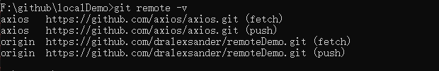
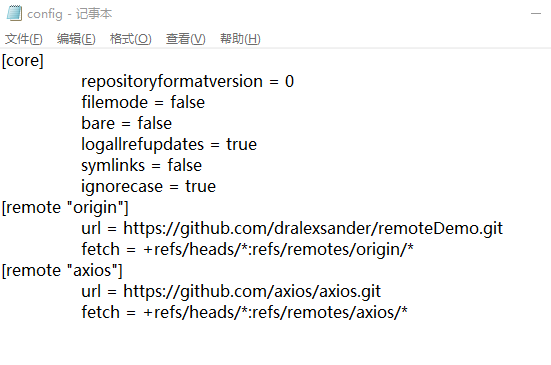
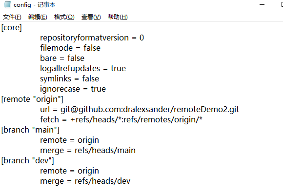

# 使用 GitHub 远程仓库

GitHub 是最大的 Git 版本库托管商，是成千上万的开发者和项目能够合作进行的中心。 大部分 Git 版本库都托管在 GitHub，很多开源项目使用 GitHub 实现 Git 托管、问题追踪、代码审查以及其它事情。本篇文章主要带大家上手 GitHub 最基本的使用方式。


## 创建 Git 仓库

先登入 GitHub，再进入 GitHub 首页： https://github.com

点选右上角的使用者名称进入个人首页：


切换到 Repositories 后点击 New 按钮填写仓库名即可创建一个仓库：


在创建好后，我们就可以复制这个远程仓库地址，使用 git clone 命令把远程仓库下载到本地。

> git clone 命令
> 将远程仓库复制到本地，并建立工作目录与本地仓库 (就是 .git 文件夹)

如果我们在创建的时候没有勾选 Initialize this repository with a README，那么创建出来是一个空仓库。

Github 中也有相关的提示：


## 远程仓库的添加

前面 创建 Git 仓库 部分我们只提到通过 clone 命令把远程空仓库下载到本地。那如果我们想要把本地的仓库与远程仓库建立关联呢？

比如说我们有个 localDemo 这个本地仓库，想要与远程的 https://github.com/dralexsander/remoteDemo.git 仓库建立关联，可以直接使用下面的命令：

```shell
git remote add origin https://github.com/dralexsander/remoteDemo.git
```


从上图可以看到执行完命令后没有任何输出，但其实它修改了 .git/config 这个文件。


多了一个 [remote "origin"] 的配置，这个 origin 的意思就是远程仓库的名字（就是我们通过 git remote add origin xxx 给 remoteDemo 这个远程仓库定义的名字，当然也可以改成 git remote add remoteDemo xxx）。url 就是这个远程仓库的地址。fetch 就是本地分支与本地追踪分支的对应关系，refs/heads 里存储本地分支，refs/remotes/origin 存储本地追踪分支。

事实上在我们的本地仓库中，可以建立多个远程仓库的关联。

比如说在我们当前本地仓库 remoteDemo 中，关联多一个 axios 的远程仓库，通过 git remote -v 命令可以查看目前在「工作目录」里的远程仓库信息

```shell
git remote add axios https://github.com/axios/axios.git
```




在 .git/config 文件中也多了 axios 远程仓库的配置：




不过，通常我们关联多个远程仓库的机会并不多，因此稍加了解顺便理解一下 origin 只是一个远程仓库的参照名称即可。

## 远程分支

我们先创建一个非空仓库，然后使用 git clone 命令将远程仓库复制到本地，深入看一下发生了什么。


Git 会自动帮我们配置好.git/config 文件里的远程仓库信息：


而且最明显的是我们的本地仓库上多了一个 remotes/origin/main 分支（ remotes/origin/HEAD 是远程 main 分支的指针），通过 git branch -a 命令（不带 -a 参数展示的是本地的分支， -a 可以展示全部）查看：


我们先前学习过关于「分支」的概念，不过仅限于「本地分支」，今天我们多出了个「远程分支」，事情就相对复杂一些。

基本上，当我们的版本控制流程加上了远程仓库之后，原本的分支就可以被拆成四种不同的概念：

1. 远程追踪分支

这个分支位于远程，目的是用来追踪分支的变化情形。通常远程分支我们是获取不到的。

2. 本地追踪分支

当我们执行 git clone 复制一个远程仓库后，所有远程追踪分支会被下载回来，并且相对应的建立起一个同名的本地追踪分支。本地追踪分支反映了远程仓库在我们最后一次与它通信时的状态。

也就是这张图里的：


红色部分的 remotes/origin/main 就是本地追踪分支，remotes 标识是远程的意思，而 origin/ 是一种命名规范，main 就是分支名称，远程仓库的名称就是 origin（origin 是在 Git 版本控制中惯用的预设远程分支的**参照名称**）。

> 远程分支有一个命名规范 —— 它们的格式是:
> 
> \<remote name>/\<branch name>


3. 本地分支

在执行 git branch 命令后所显示的分支，就是所谓的「本地分支」，这些分支存在于本地，而这些分支又常被称为 主题分支 (Topic Branch) 或 开发分支 (Development Branch)，就是因为这些分支不会被推送到远程仓库，主要用来做开发用途。

4. 远程分支

顾名思义，远程分支就是在远程仓库中的分支，如此而已。如果我们用 GitHub 的话，我们是无法存取远程分支的。

虽然说「概念上」可以分为这四类，但其实这些分支就只是参照名称而已，而前面提到的「本地追踪分支」主要就是用来跟远程的分支做对应，我们不应该直接在这些分支上建立版本 (虽然我们还是可以这么做，但强烈不建议乱搞)，而是把这些「本地追踪分支」视为是一种只读的分支。


### 分支推送

#### clone 项目

经过前面的学习，我们知道在 clone 一个新的 Git 仓库时，都会有一个预设 main 分支。实际上，这个分支通常用来当作目前系统的「稳定版本」，也就是这个版本必须是干净且高品质的原始码版本。所以，我们会要求所有人都不要用这个分支来建立任何版本，真正要建立版本时，一定会通过「合并」的方式来进行操作，以确保版本能够更容易被追踪。

在开发阶段，我们通常会从 main 分支中新建一个分支用来开发：

```shell
git checkout -b dev
```


此时我们新建分支并未跟远程仓库建立起任何关联，Git 可能不知道我们到底想推送到哪里（可能存在多个远程仓库），我们直接执行 git push 命令的话 Git 就会提示错误，所以我们要另外定义本地分支与远程仓库之间的关系。


要将本地分支起跟远程仓库的建立起对应关系，只要在 git push 的时候加上 --set-upstream 参数，即可将本地分支注册进 .git/config 文件中，之后就能用 git push 就可以顺利的推送上去。


.git/config 文件：



上图中的 remote 和 merge 所代表的意思是：「当我们想要将本地的 dev 分支推送到远程仓库时，预设的远程仓库为 origin 这个（因为可以关联多个远程仓库，因此需要指定），然后推送的时候要将本次的变更合并到 merge 字段对应这个远程分支里。

> 我们在一开始执行 git clone 的时候，Git 就会预设帮我们建立好 main 分支的对应关系，所以针对 main 分支进行操作时，不需要额外加上 --set-upstream 就能使用。


#### 本地关联项目

如果我们是直接本地仓库与远程仓库建立关联的，这个时候情况可能不一样。

我们用回之前的 remoteDemo 示例，前面我们只介绍了如何与远程仓库建立关联（git remote add），如果此时我们执行 git branch -a 命令查看分支，可以发现并不存在本地追踪分支，这是因为远程仓库是空的，根本不存在任何分支：


此时我们就需要执行 git push --set-upstream origin master 命令来建立与远程仓库的分支关联：


我们来详细说明一下这个打印：

在执行 push 命令时会扫描 .git/objects 目录，也就是之前我们之前文章中提到的 Git 的对象，然后把这些对象放入到远程仓库中（同步版本）。但是由于远程仓库的空的，因此也创建了一个 master 分支并在本地设置了一个追踪分支。

我们查看 .git/refs 目录就可以看到新建了一个 remotes 目录，里面的内容就是本地追踪分支。


这时候在执行 git branch -a 命令就会发现存在红色的 remotes/origin/master 分支了:


此时本地分支与本地追踪分支都是同步的，我们可以通过 git log 命令来查看：


## 代码拉取

这部分需要结合前面 远程分支 部分一起讲解，我们在 clone 一个远程仓库后，所有远程追踪分支会被下载回来，并且相对应的建立起一个同名的本地追踪分支。如果远程仓库更新了几个版本后，我们的本地追踪分支相较于远程仓库其实就落后了几个版本，此时我们就要更新本地追踪分支的状态。

### fetch

git fetch 命令完成了仅有的但是很重要的两步:

- 从远程仓库下载本地仓库中缺失的提交记录
- 更新本地追踪分支指针（如 remote/origin/main ）


git fetch 实际上将本地仓库中的远程分支更新成了远程仓库相应分支最新的状态。

前面我们说过的，本地追踪分支反映了远程仓库在我们最后一次与它通信时的状态，git fetch 就是我们与远程仓库通信的方式！

我们用一个可视化来更好理解 fetch 命令：


我们一开始 clone 项目后分支状态类似上面这张图，此时我们在远程仓库中提交一个版本后在本地仓库中执行 git fetch 命令。


可以看到只有本地追踪分支（ remote/origin/main ）才更新了状态，本地的 main 分支并没有更新，如果我们需要更新本地 main 分支，需要手动使用 git merge 命令去合并本地追踪分支（ remote/origin/main ）。

#### 示例

概念理解了我们来看一下示例：


本地分支与本地追踪分支都是同步的（最新「commit 对象」的 hash 值为 bcbe312...），此时我们在远程仓库中提交一次 commit:


远程仓库最新的 commit hash 值为 62ed650。

我们执行 git fetch 命令更新本地追踪分支：


此时 remotes/origin/master 领先 master 分支一个提交，我们切换到 remotes/origin/master 分支查看提交日志能更清楚的看到差异：


在这种情况我们就需要执行 git merge remotes/origin/master 命令来更新 master 分支：


### pull

git pull 就是 git fetch 和 git merge 的缩写，会自动帮我们更新本地追踪分支和本地分支。


