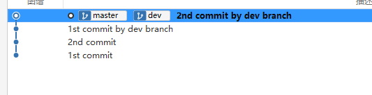

# fetch、pull命令详细介绍

在上一章 [使用 GitHub 远程仓库](https://blog.csdn.net/qq_42880714/article/details/135514776) 文章中我们简单介绍了一下 fetch 和 pull 的使用，现在我们来深入了解一下这两个命令。

## fetch

回顾一下上一章的可视化图

我们通过 git fetch 命令更新的只是本地的追踪分支（ origin/main ）

### 分支相关

#### 新增

如果此时远程仓库中多了一个 dev 分支，我们可以通过 git remote show origin 命令来查看远程仓库的分支状态：

从上面的描述中我们就可以知道远程仓库中新增了一个 dev 分支，并且我们在下一次的 fetch 命令中就会在本地建立一个 remotes/origin/dev 追踪分支。

我们通过 fetch 命令更新的代码并不会在本地新创建一个分支与新的本地追踪分支建立关系，我们需要手动通过 git checkout \<branchName> 命令把这个本地追踪分支取出来并自动帮我们建立起一个同名的「本地分支」，所以我们根本不用担心没有本地分支的情形。

这时候在执行 git remote show origin 命令就会发现 dev 分支已被追踪了：

#### 删除

我们把刚刚远程仓库创建的 dev 分支给删除掉：

我们通过 git remote show origin 命令就可以发现提示 dev 分支过期了：

此时我们可以通过提示的 git remote prune 或者 git fetch --prune 命令去删除本地的追踪分支（本地分支仍存在）

git fetch 并不会更新我们的本地分支，也不会修改我们「工作目录」上的文件。理解这一点很重要，因为许多开发人员误以为执行了 git fetch 以后，他们本地仓库就与远程仓库同步了。它可能已经将进行这一操作所需的所有数据都下载了下来，但是并没有修改我们本地的文件。

## merge

### fast-forward

而我们如果想要更新本地的 main 分支，就要执行 git merge origin/main 命令，在这种情况下，main 分支没有额外的 commit 操作，在执行 merge 命令时只需要修改 .git/refs/heads/master 的内容，将其改为最新的「commit 对象」的 hash 值即可（也就是移动指针）。这样分支的合并线是一条直线，这个过程叫做 fast-forward。

通常，合并分支时，Git 会用 fast-forward 模式，但这种模式下，删除分支后，会丢掉分支信息。

我们可以来看一个示例：

此时 dev 和 master 分支都处于同一个 commit，在 dev 分支上提交几次。

dev 分支领先 master分支两个 commit。

我们使用之前 [git 的安装](https://blog.csdn.net/qq_42880714/article/details/135538648?spm=1001.2014.3001.5501) 文件提到的 sourceTree 工具来看看分支图谱：

可以看到是处于一条直线上的，切换到 master 分支后执行 git merge dev 命令即可实现 fast-forward 合并。

如果我们把 dev 删除了，那么之后的历史记录里就没有这个分支记录了。

### no-fast-forward

如果我们想保存分支的记录，可以在 merge 的时候添加 –-no-ff 参数，这样就可以在合并的时候添加多一个 merge 相关的 commit。

我们通过 git log 命令可以很明显的看到这个 commit：

这时候删除 dev 分支，图谱上依旧能明显看到之前是存在一个分支的：

### three way merge

在 [git 中分支的概念及使用](https://blog.csdn.net/qq_42880714/article/details/135439018) 文章中提到，合并操作通常都要解决冲突问题：

比如：

在上图中，远程 main 分支领先本地追踪分支（ origin/main ） 3 个 commit，在本地 main 分支中又存在两个 commit，此时执行了 git fetch 命令后，分支情况如下：

在执行 merge 命令时就会形成如下的结构，跟 no-fast-forward 类似，也会形成一个 merge commit。

**注意：此时 origin/main 的指针并不会变，只有在执行了 push 命令的时候才会更新。**

推送到远程仓库后，此时本地分支和本地追踪分支才处于同一状态：

## FETCH_HEAD 文件

我们在执行 fetch 命令的时候，会在 .git 目录下生成一个 FETCH_HEAD 文件。

示例存在 master 、dev、dev-beta 三个分支：

上图展示就是的通过 fetch 从远程仓库里的分支最新状态，我们同时可以很明显看到第一行是没有 not-for-merge 标识的，在执行 fetch 命令时当前「工作目录」所处的分支对应的远程分支信息就 FETCH_HEAD 文件里的第一行。

我们切换一下成 dev 分支在 fetch 一下就会发现 FETCH_HEAD 文件的第一行是 远程 dev 分支的信息：

至于 not-for-merge 这个标识的作用我们在 pull 命令部分在讲解。

## ORIG_HEAD 文件

在执行 pull 或者 merge 命令后会将当前分支最新的一次提交的 hash 值留在 ORIG_HEAD（只存在最新的一条，后续出现的 hash 会覆盖掉原来的）。

比如说我们要合并本地追踪分支的最新状态，先看看 dev 分支最新一次的commit：

之后执行 git merge origin/dev 进行合并，此时会生成一个 merge commit 同时也会把 dev 分支在合并前的最新那次 commit 的 hash 值（上图中的 53fe05... ）记录入到 ORIG_HEAD 文件中。

如果不满意此时的合并结果，就可以通过 git reset --hard ORIG_HEAD 命令可以回退到之前的版本。

可以从 git log 命令看到 dev 分支的最新 commit 又回退到之前的（53fe05...）

## pull

[上一章](./06-使用%20GitHub%20远程仓库.md) 提到 git pull 命令其实包含了 fetch 、 merge 两个命令。

前面说到执行 fetch 命令会生成一个 FETCH_HEAD 文件，里面有些分支会有 not-for-merge 标识，这个就是告诉 Git 这些分支拉取到的新内容不需要自动 merge，只有当前分支才需要 merge:

我们来看个示例：

当前远程 master 和 dev 分支都存在更新，我们在 master 分支执行 pull 命令：

在上图中第一条红线及绿线都标识了从远程仓库获取到了新内容；第二条红线则是标注了本地的 master 分支进行 merge，是一个 fast-forward。而 dev 却没有 merge，如果我们想要合并，可以切换成 dev 分支后执行 merge 或 fetch 命令。

**如果我们不清楚，不确定 git pull 代码是否会存在冲突，可以使用 git fetch，然后使用 git diff origin/\<branchName> 查看差异之后自行合并**
