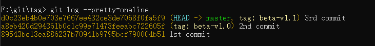

# tag 标签

在使用 Git 版本控制的过程中，会产生大量的版本。如果我们想对某些重要版本进行记录，就可以给仓库历史中的某一个commit 打上标签，用于标识。

在本章中，我们将会学习如何列出已有的标签、如何创建和删除新的标签、以及标签的类型。

## 基本概念

事实上，标签只是用来记录某一个「commit 对象」的 hash 值，以一个比较好记的名称来帮助我们记住某个版本。

Git 支持两种标签：轻量标签（lightweight）与附注标签（annotated）。

tag 相关的文件在 .git/refs/tag 文件夹中，文件名就是 tag 名。

### 轻量标签

轻量标签很像一个不会改变的分支 —— 它只是某个特定「commit 对象」的引用。

但是如果我们通过 git cat-file -p \<tagName> 来查看标签的内容，就会发现内容其实是一个「commit 对象」，这就是前面提到的轻量标签只是某个特定「commit 对象」的引用，最终还是会指向这个「commit 对象」：

### 附注标签

而标注标签则是一个 git 对象，在 [04-git 中的概念](./04-git%20中的概念.md) 文章介绍了 Git 中存在的 4 种对象。

附注标签对象包含打标签者的名字、电子邮件地址、日期时间， 此外还有一个标签信息，并且可以使用 GNU Privacy Guard （GPG）签名并验证。 

通常会建议创建附注标签，这样我们可以拥有以上所有信息，并且可以永久保存在 .git 文件夹中（储存到仓库中的 Git 对象都是不变的，只有索引才是变动的）。但是如果我们只是想用一个临时的标签， 或者因为某些原因不想要保存这些信息，那么也可以用轻量标签。

从上图可以看到 beta-v1.1 文件的内容与最新「commit 对象」的 hash 值不同，这时通过 cat-file 命令就可以发现这个 hash 值对应的是一个「tag 对象」:

可以看到「tag 对象」内存在一个对象 hash 值，就是最新「commit 对象」的 hash 值，第二行的 type commit 就是介绍上一行的对象的类型是一个「commit 对象」，这代表我们也可以把任何 Git 对象都建立成一个标签对象。

> git tag \<tagName> -a 会将当前的 HEAD 指针指向的版本建立成「tag 对象」，如果要将其他特定对象建立为标签的用法为 git tag \<tagName> \<hashId>

## 创建标签

创建标签的命令非常简单，就是 git tag \<tagName>，不过这是创建轻量标签的方式，如果要创建附注标签则需要**带上 -a 参数**，同时还要跟 commit 命令一样带上 -m 参数指定了一条将会存储在标签中的信息，如果没有为附注标签指定一条信息，Git 会启动编辑器要求我们输入信息（如果只有使用 -m 参数时 Git 会默认把 -a 也帮我们加上）。

### 为之前的版本创建版本

git tag \<tagName> 命令都是在当前的 HEAD 指针指向的版本进行标记，如果我们想要为之前的版本进行标记，可以在命令后面加上 \<hashId>。

假设我们要为第一次的 commit 添加一个标签，可以执行 git tag -a beta-v0.0 8954：

## 查看标签

使用 git tag 可以查看所有的标签：

> 按照通配符列出标签需要 -l 或 --list 选项
> 
> 如果我们只想要完整的标签列表，那么运行 git tag 就会默认假定我们想要一个列表，它会直接给我们列出来， 此时的 -l 或 --list 是可选的。
> 
> 然而，如果我们提供了一个匹配标签名的通配模式，那么 -l 或 --list 就是强制使用的。

而使用 git show \<tagName> 命令就可以查看某个标签的具体信息：

## 删除标签

要删除掉我们本地仓库上的标签，可以使用命令 git tag -d \<tagName>：

**注意上述命令并不会从任何远程仓库中移除这个标签**

## 推送标签

### 新增

默认情况下，git push 命令并不会传送标签到远程仓库上。 在创建完标签后我们必须显式地推送标签到远程仓库。 这个过程就像推送分支一样 —— 我们可以运行 git push origin \<tagName>。

如果想要一次性推送很多标签，也可以使用 git push origin --tags （带上 --tags 参数）。 这将会把所有不在远程仓库上的标签全部推送上去。

### 删除

跟新增标签一样，我们在删除标签时，也只是在本地仓库上进行操作，也需要推送到远程仓库中才能删除远程仓库中的标签：

使用 git push origin --delete \<tagName> 命令即可：

## 签出标签

如果我们想查看某个标签所指向的文件版本，可以使用 git checkout \<tagName> 命令， 但是这会使我们的仓库处于“分离头指针（detached HEAD）”的状态，在这种状态下，如果我们做了某些更改然后提交它们，标签不会发生变化， 但我们的新提交将不属于任何分支，并且将无法访问，除非通过确切的 hash 值才能访问。 因此，如果我们需要进行更改，比如我们要修复旧版本中的错误，那么通常需要创建一个新分支：

若想查询 git tag 的完整用法，可执行 git help tag 即可显示完整的文件说明。