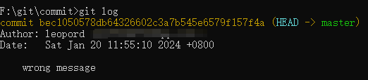
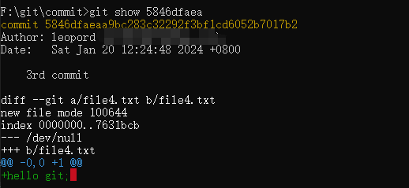
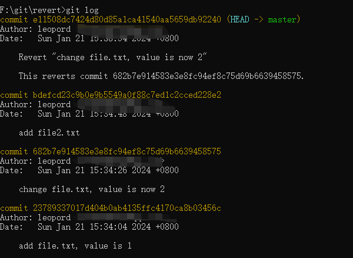
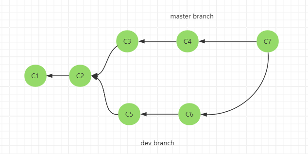

# commit 历史版本记录修正

当 Bug 发生的时候，我们会需要去追踪特定 bug 的历史记录，以查出该 bug 真正发生的原因，这个时候就是版本控制带来最大价值的时候。

因此，要怎样维持一个好的版本记录是非常重要的，下面是一些版本提交经验：

- 做一个小功能修改就要进行提交，记录一个版本，这样才容易追踪变更；
- 不要累积一大堆修改后才提交，这样就会导致记录的是一个大版本，不易追踪细节功能；
- 有顺序、有逻辑的增加新功能，这样才能确保相关的版本可以按顺序提交，更有利于追踪变更；

不过，在多人协同合作开发的时候，很难保证所有人都能按照上面的几点进行版本控制。我们的习惯更多的可能是想到哪就改到哪，在改完之后就提交。基于这种情况，Git 中存在一个「修改版本」的机制，让我们在把提交推送至远程仓库之前，可以重写历史提交记录，这样就可以使得推送的版本已经是完美的状态。

> 在满意之前不要推送我们的工作
> Git 的基本原则之一是，由于克隆中有很多工作是本地的，因此我们可以 **在本地** 随便重写历史记录。 然而一旦推送了我们的工作，那就完全是另一回事了，除非我们有充分的理由进行更改，否则应该将推送的工作视为最终结果。 简而言之，在对它感到满意并准备与他人分享之前，应当避免推送我们的工作。

## 需要修改记录的情况

在之前的几篇文章里，我们提到了 Git 的版本控制的仓库就处于 .git 文件夹中，如果我们是多人协同开发，那么到时候就有多人拥有这个仓库，如果有人任意窜改历史记录，那么这个版本控制就没有意义了。**所以我们必须要谨记，修改记录只能在本地进行，在已经推送到远程仓库时，就不要在更改了**。

那么，在什么样的情况我们会需要去修改版本记录呢？以下几点大家可以参考一下：

- 当某个版本提交错了，必须要删除这个版本的所有提交；
- commit 的时候提交信息有误，想要修改信息，但是不会影响到文件的变更；
- 想调整提交版本的顺序，让更改历史更加有逻辑性；
- 当某个提交版本缺失重要文件，想重新添加上去；

## 修改记录的几种方法

在 Git 中有几种可以修改记录的方法，这些方法都有不同的适用情形，我们来逐个介绍一下：

### commit --amend

修改最后一次提交。

修改我们最近一次提交可能是所有修改历史提交的操作中最常见的一个。对于我们的最近一次提交，我们往往想做两件事情：简单地修改提交信息，或者通过添加、移除或修改文件来更改提交实际的内容。

命令也非常简单：git commit --amend。不过命令的执行顺序需要注意一下：

1. 如果我们只是想修改最近一次提交的提交信息，直接执行 git commit --amend 即可，在执行完后会打开一个编辑器，在这个编辑器中 Git 会将最后一次的提交信息载入到编辑器中供我们修改，当保存并关闭编辑器后，编辑器会将更新后的提交信息写入**新提交**中，它会成为新的最后一次提交。
  
    例如，我们的最新一次的提交信息写错了：

    
  
    执行 git commit --amend 命令打开了一个编辑器，重新编辑信息：
  
    
  
    之后再执行 git log 查看可以发现最新的提交信息已经更改，但是 hash 值变了，其实这是一个新的 commit:

    

2. 如果我们想修改最后一次提交的实际内容（修改文件或者添加文件），那么就需要先把这些改动添加到「暂存区」，之后再执行 git commit --amend:

    例如我们需要在这次提交添加多一个 file2.txt 文件：
    
    

    

### reset

git reset 主要用来重置目前的工作目录。不过，也可以用来修正版本历史记录。

#### 删除最新一次的版本

例如当前我们有三个提交版本：

想要删除最新一次版本，可以执行 git reset --hard "HEAD^" 命令（HEAD 是一个指针，指向当前最新一次提交，保存在 .git/HEAD 文件中）。

**在「命令提示符」中 ^ 是特殊符号，所以必须用双引号括起来**

此时我们可以看见，原本的最新版被删除了，那是因为刚刚我们执行 git reset --hard "HEAD^" 这个动作，把 HEAD 指向的位址改到了前一个版本 ( HEAD^ )，所以我们执行 git log 命令就看不到这个版本了。

事实上，原本我们感觉被删除的版本，其实一直储存在 Git 的对象储存区中（也就是在 .git/objects 目录下）。我们还是可以用 git show 5846df 取得该版本 (即「commit 对象」) 的详细信息：

**执行有风险的操作，如 merge，reset、rebase 等会影响当前指针的操作，都会把当前指针储存在 .git/ORIG_HEAD 文件中，只要执行 git reset --hard ORIG_HEAD 都可以还原回去。**

#### 删除最新一次的版本，但保留最后一次的变更

git reset --soft "HEAD^" 命令可以删除最新一次的版本，但是在「暂存区」仍然保留着文件变更的信息。

例如在最新的一次提交中添加了一个 file4.txt 文件，然后执行 git reset --soft "HEAD^" 命令删除掉这次的版本，此时 file4.txt 仍处于「暂存区」中，通过 git status 即可看到 file4.txt 文件的状态

这也意味着，我们可以保留最后一次的变更，再加上一些变更后，重新执行 git commit，就可以重新提交一个新的 commit。

### revert

还有个常见的情况，那就是当执行了多个版本之后，才发现前面有一个版本改错了，但是我们想保留改错版本之后的所有变动，只想把改错的版本修复好，这样的话 reset 就不适用了，可以考虑 revert 命令：

比如说我们添加了一个 file.txt 文件，改动了一次，之后又添加了一个 file2.txt 文件：

最后发现把 file.txt 的内容改成 2 是错的，而此时我们希望可以将该版本还原成原始版本就好，而不是修改当前版本成第一版然后提交，那么就可以试试 git revert \<hashName> 指令：

由于改动是从 682b7e... 版本（把内容改成2）开始的，因此需要返回到这个版本：

再执行了 git revert 682b7 命令后，会打开一个编辑器让我们编辑最后要 commit 的消息，预设会加上 Revert 字样，还有会在第二行的地方加上 This reverts commit xxxx 告诉我们说这个版本主要目的是从 xxxx 版本还原的。

保存后会额外再建立一个新版本，执行 git log 命令看看结果：

#### 解决冲突

如果我们要还原的版本与当前的版本的文件存在差异，那么就会导致冲突（Git 内部会执行合并操作）。

我们把上面的还原版本重置一下，重置成未还原的版本：

然后修改 file.txt 的内容为 3，此时再执行 git revert 682b7 把 file.txt 的内容还原成 3，就会造成冲突：

发生本次冲突的原因就在于，我们想还原的 682b7 这个版本，这次的变更原本是 1 改成 2，由于我们想还原内容，则是把 2 改为 1，但我们现在的内容却是 3 而不是 2，因而发生了冲突状況。

解决冲突的方法我们在 [05-git 中分支的概念及使用](./05-git%20中分支的概念及使用.md) 中讲过了，这里就不再赘述。

在解决完冲突之后，我们仍需要执行 git add 命令把已解决冲突的文件放入「暂存区」，之后执行 git revert --continue 继续执行还原流程，这个命令同样会打开编辑器，这里的预设内容也会标示那些文件发生了冲突：

### cherry-pick

如果我们在某个分支上开发，但后来决定整个分支都不要了，不过当中却有几个版本还想留下，这时要删除分支也不是，把这个分支合并回来也不是、这时候就可以使用 git cherry-pick \<hashId> 命令了。

使用 git cherry-pick 跟使用 git revert 非常相似，也是让我们「挑选」任意一个或多个版本，然后合并到当前分支的最新版上。

目前我们存在一个 newBranch 分支领先 master 分支两个版本，我们切换回 master 分支，并执行 git cherry-pick 225bac9 命令把 225bac9 版本合并到 master 上，若成功执行，则会在目前的 master 分支建立一个新版本。

> 不过，与 git revert 最大的不同之处，就在于执行完 git cherry-pick 命令后，其建立的版本消息，将会与我们指定挑选的那些版本一模一样，其中包括 Author 与 Date 栏位，都会一模一样，并不会用我们在选项设定中指定的 user.name 与 user.email 参数。这点我们必须特别注意！

#### -x 参数

如果我们在命令上加上 -x 参数，就会像 git revert 那样，自动加上 (cherry picked from commit xxxx) 的消息：

不过，做这个动作之前也请先思考，我们这次挑选的版本是不是只有「本地才有的分支」上挑选的，如果是的话，这样的记录可能会造成其他人的混淆，因为他们查不到该版本的任何信息。这在使用远端仓库的情境比较会碰到。

### rebase

严格上来说 git revert 与 git cherry-pick 并不算是修正历史版本记录，而是套用先前曾经 commit 过的版本，而这个所谓的 rebase 机制就是真的用来修改 commit 记录的功能了，其功能重要而且强大。

#### 什么是rebase

git rebase 是一个命令，可以帮助我们将更改的代码从一个分支集成到另一个分支。想象一下我们正在建造一座塔，我们已经建立了一个坚固的基础，但在中途，我们决定在不影响上面的结构的情况下改变基础。这就是 rebase 的作用 —— 它改变了分支的基础。

用技术术语来说，rebase 是将一系列提交移动或组合到新的基础提交的过程。

我们来个跟 merge 对比的示意图来更好的理解：

假设我们有个存在 master、dev 分支的仓库，且各自都有提交版本：

当我们在 master 分支执行 git merge dev 命令后，结构示意图如下：

而当在 master 分支执行 git rebase dev 命令后，结构示意图如下：

将master 分支的整个历史记录放在 dev 分支顶部来提供线性历史记录。

我们用一个实例结合 sourceTree 看看会容易理解：

在这个实例中存在 master、newBranch 两个分支：

当我们在 master 执行 git merge newBranch 后，图谱里提交记录变成了一条直线：

虽然此时看起来像只有一条 master 分支，其实还是存在两个（master、newBranch）的。