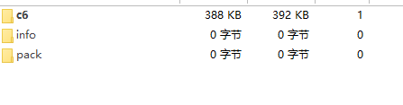
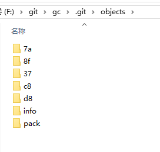
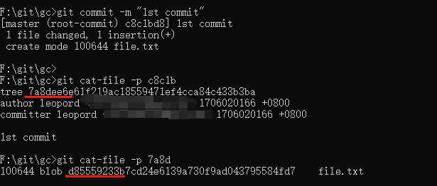

# git 对象压缩及垃圾对象清理

这篇文章让我们来看看 git 的对象压缩机制，前面的几篇文章我们提到，在执行 git add 命令会会把文件先通过 zlib 压缩后放入到「暂存区」，我们先看看这个步骤：

我们这个实例中有一个 1.28m 的 index.js 文件：


初始化一个仓库，然后执行 git add . 命令把文件添加到「暂存区」，在 [04-git 中的概念](./04-git%20中的概念.md) 文章里我们说过这个命令会生成一个「blob 对象」(也就是在一个 .git/objects 文件中生成一个经过 zlib 压缩的文件):




从上图可以看到 index.js 文件体积明显减少了很多，能帮我们节省磁盘空间，而通过 git cat-file \<hashId> 就可以查看源文件。

我们先执行一下 commit，此时就会生成一个「tree 对象」和一个「commit 对象」，因为这两个文件存储的是索引，所以非常小。


如果我们稍微修改 index.js 文件中的几个字符在重新执行 git add . 命令看看会发生什么：


可以很明显的看到又多一个差不多大小的文件，我们可以设想到如果我们的原始文件很大，或者执行了非常多次的 add、commit 命令，这个 objects 文件将变得非常大：


但是我们的「工作目录」才只有一个 1.28m 的文件，同时每次只是修改了几个字符，对比起来 .git 文件是不是太大了（上图只执行了4次的add、commit操作，当文件多了会更明显）。针对这个问题 Git 提供了一个命令： git gc，这个命令可以把 Git 对象进行压缩。


在经过 dalta 压缩后，GIt 对象（.git/objects文件中的文件）都会被删除，同时在 .git/objects/pack 文件夹中生成相应的压缩文件：


可以看到经过压缩后 .git/objects 文件夹体积又变小了，

.pack 文件体积较大，我们可以很明显猜到这就是存储我们文件的地方，而 .idx 文件储存的就是索引，因为 .git/objects 文件夹里的对象都清除了，但是我们还是可以通过执行 git log 或者其他命令获取到对象相关的信息:


通过 cat-file 命令还是能查看到「commit 对象」、「tree 对象」、「blob 对象」:


通过这个 .idx 文件我们就能快速到找到 .pack 文件中对应的 commit 或者 blob的内容。

## 查看压缩文件

我们可以通过 git verify-pack -v \<fileName> 命令来查看压缩文件：


从上图可以看到，.pack 文件保存了之前 add、commit 生成的「commit 对象」、「tree 对象」、「blob 对象」。我们来重点看看标注的地方：

黄色框内的数字就是文件的大小及压缩等信息，红色线就是第一次add的生成的「blob 对象」，蓝色线就是之后3次 add 生成「blob 对象」，后面同时还带上了第一次add的生成的「blob 对象」，说明记录的只是文件的差异，因此在经过压缩后 .git/objects 文件大小会明显降低。

## 压缩的作用

在传输过程中减少带宽，减少本地磁盘的占用空间。

我们在执行 push 的时候，推送的就是压缩的 pack 文件（减少带宽，较少上传时间），但是我们本地的仓库并没有被压缩：


我们来看一个更明显的例子，拉取 vue 的代码:

```shell
git clone git@github.com:vuejs/vue.git
```


可以看到有 62255 个对象，.git 文件大小为 31.51MB。


从 .git/objects 文件中也可以看到下载的对象都是经过压缩的。 Git 也提供了一个 unpack-objects  命令来帮助我们把对象解压出来。

不过我们不能直接把 .git/objects/pack 文件夹中的 .pack 文件进行解压，需要移动到其他文件夹中：


在上图中我们把 .pack 文件移动到 .git 目录下：


之后执行解压缩命令 git unpack-objects < .git\pack-6abcda5b8a6ba30f796c774e6177e10757ff9865.pack ：


可以看到相比起压缩的 .pack 文件，解压出来的对象占用空间更大，如果我们 clone 仓库的时候，对象没有压缩，那么我们将耗费更多的带宽及下载时间。

## 垃圾对象清理

我们在执行一些 Git 操作的时候，会生成一些「blob 对象」等，这些没有被引用的对象就是垃圾对象。

什么意思呢，比如我们重复修改一个文件，每次修改后都执行 add 命令添加到「暂存区」，之后执行 commit 保存版本，那么在期间生成的一些「blob 对象」没有被引用（只有最后一次 add 生成的「blob 对象」才被引用了），这些就是垃圾对象。前面说了如果这些文件非常大，那么就会导致 .git 文件变得非常大，因此清理垃圾对象非常重要。

我们来看看下面的示例，执行三次 add 命令和一次 commit，那么就会生成 5 个对象：




通过 cat-file 命令来看看「commit 对象」到底引用了哪些对象：



可以看 7a（「tree 对象」）、d8（「blob 对象」）、c8（「commit 对象」）都是存在引用的，8f、37 文件里的就是垃圾对象。

Git 也提供了一些命令来让我们查看未引用的对象：

git fsck --dangling 或者 git prune -n


### 清除命令

- git prune
- git gc

git gc 在压缩对象的时候也会执行 git prune。

在执行 git gc 进行压缩后，可以看到 .pack 文件里实际只有三个对象，其余两个垃圾对象并没有被记录下来：


### 分支

如果我们在分支上进行 add、commit 操作，之后把这个分支删除掉，那么对于我们来说在分支上生成的这些对象都是垃圾，都是需要清除的，但是对于 Git 来说这些却不是垃圾对象，因为它会觉得我们可能会需要执行 checkout 命令把这些对象重新取出来。

比如我们新建一个 newBranch 分支，修改文件并执行 add 、commit，然后切换回 master 分支把这个分支删除掉：


可以看到我们执行 git prune -n 并没有提示有任何的垃圾对象，执行 git prune 删除也没反应。

其实通常我们是不需要删除这种对象的，除非我们非常确定这个对象该删除（存在一些秘密信息或者大量无用文件），那么我们可以执行一下命令：

```shell
git -c gc.reflogExpire=0 -c gc.reflogExpireUnreachable=0 -c gc.rerereresolved=0 -c gc.rerereunresolved=0  -c gc.pruneExpire=now gc 
```
