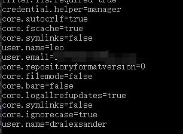
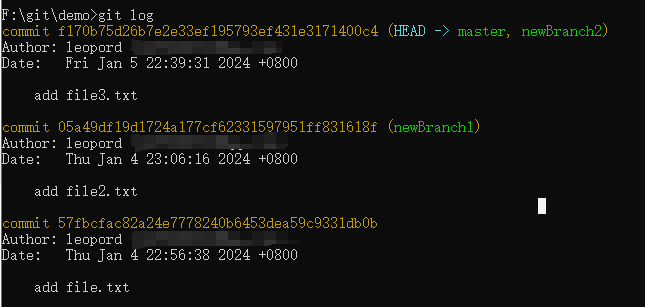
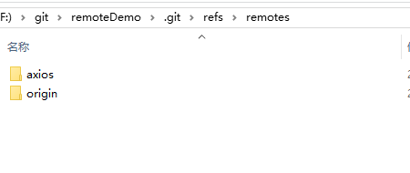

# .git 文件夹结构解析

在这篇文章就让我们来看看这个 Git 仓库里的文件分别都是用来干什么的，以及在执行了相关的 Git 命令后这些文件会如何响应。

- hooks（钩）：存放一些shell脚本
- info：存放仓库的一些信息
- logs：保存所有分支的 commit 记录及 HEAD 操作记录。
- HEAD：映射到 refs 引用，这样就能够找到当前分支最新的一次提交的 hash 值。
- objects：存放所有的git对象
- refs：
- - heads：保存所有分支中当前最新的一次提交的 hash 值
- - remotes：保存所有远程仓库的所有分支当前最新的一次提交的 hash 值。
- - tags：保存所有标签对应的提交的 hash 值。
- COMMIT_EDITMSG：最新提交的一次Commit Message，git系统不会用到，给用户一个参考
- description：仓库的描述信息，主要给gitweb等git托管系统使用
- config：当前git仓库的配置文件
- index：存储暂存区（staging area）的信息
- FETCH_HEAD： 是一个版本链接，指向着目前已经从远程仓库取下来的分支最新的一次提交的 hash 值
- HEAD：映射到 refs 引用，能够找到当前分支最新的一次提交的 hash 值
- ORIG_HEAD: 执行 pull 或者 merge 后会将当前分支最新的一次提交的 hash 值留在 ORIG_HEAD。


## config

通过 git config 命令进行配置。

我们先执行看看 config 文件里有什么配置：


之后我们执行 git config 配置一些用户信息：

```shell
git config user.name "dralexsander"
```


**不能携带 --global 参数，否则就会修改到全局的配置**

此时我们执行 git config -l 查看所有的配置可以发现当前项目的配置和全局配置合并到一起打印出来。



如果我们需要切换用户，就可以通过 git config 进行配置。

## objects

存放所有的git对象。

git的对象分为以下四种类型：
- blob：缓存区的具体文件内容
- tree：缓存区的文件的文件夹名及对应的 blob 对象
- commit：提交的 commit 信息及 tree（root tree） 对象
- tag：对应的 commit hash（在 .git/refs/tag 文件夹里）

上面的几种类型不需要强行硬背，阅读完下面的部分想必大家都能轻易理解。

我们在执行 git init 后，objects 文件夹里只存在 info、pack 两个空文件。


当我们在根目录下输出下面的命令创建一个 file1.txt 文件，并输入 hello git; 作为内容。

```shell
echo hello git; > file1.txt
```

然后执行 git add . 命令将 file1.txt 文件放入暂存区：

```shell
git add .
```

此时我们看看 objects 文件夹中多了个名为 76 的文件夹


该文件夹里的存在一个 31bcb57512d5989050a08d7c507c8db7eebf8f 文件


我们在通过 git add 命令将文件存入暂存区时，都会将文件的内容中取出，通过内容产生一组 SHA1 哈希值，然后依照这个 SHA1 哈希值命名的一个文件并放入 objects 文件夹中。**这个文件就是 「blob 对象」**。

Git 仓库中的每一个「对象」，都是以「文件内容」进行 SHA1 哈希运算出一个 hash 值，并用这个 hash 值当作对象的名称 (文件夹名)。我们以 7631bcb57512d5989050a08d7c507c8db7eebf8f 为例，Git 会先拿前两个字元(92)当作目录名，然后把剩下的 hash 值当成文件名 (31bcb57512d5989050a08d7c507c8db7eebf8f)，这些对象的实体目录与文件也都是放在 .git\objects 目录下。

此时我们打开这个文件，可以发现里边是乱码，这是因为文件内容都是通过 zlib 算法进行压缩过的，这样不但可以有效的提升文件存取效率，在日后进行封装(pack)的时候也可以利用差异压缩(delta compression)演算法来节省空间。他会自动找出相似的 blobs，并自动计算出 blob 之间的变化差异，再将这些差异储存在一个 .pack 的文件中，这样就可以大幅节省磁盘空间的耗用。


### 使用 node 解压

如果我们想读取里边的内容，可以使用 node 中的 zlib 库进行解压。

```js
const zlib = require("zlib");
const fs = require("fs");
const path = require("path");

const file = fs.readFileSync(path.resolve(__dirname, "./31bcb57512d5989050a08d7c507c8db7eebf8f"));
zlib.unzip(file, function (err, buffer) {
  if (!err) {
    console.log(buffer.toString());
  }
});
```


可以看到解压出来的内容并非原来的文本内容，而是多了 blob 12 这几个字符（git 的处理），其中 blob 就是标识这个文件类型，11 就是文件的大小。

### 使用 git cat-file 指令读取

```shell
git cat-file -p [hashname]
```


此时读取的文件内容是不包含类型及文件大小的，我们可以使用 -t 标识来读取这个文件对象类型：


使用 -s 标识来读取文件大小：


在把文件放入「暂存区」后，我们通过 commit 命令进行提交：


解析一下上面的信息：
- master：当前 commit 的分支
- root-commit：当前分支的首次 commit，第二次的 commit 会以此作为 parent 来实现链式 commit。
- bbada81：当前 commit 的 hash 值，我们可以通过这个 hash 来获取到对应 「commit 对象」的信息
- 1st commit：当前 commit 的信息
- 1 file changed, 1 insertion(+)：当前 commit 版本与之前版本对比后的文件变动描述
- create mode 10064 file1.txt：新增了一个 10064 权限的文件，文件名为 file1.txt。（10064就是 Git 内部的文件权限标识，代表普通文件，可读可写。）

此时在 objects 文件夹上新增了一个 bb 文件夹，这个文件里有两个文件。


通过上面的 commit 消息可以看到 bbada81 开头的就是「commit 对象」

通过 git cat-file 看看这个文件对象类型及内容：


可以看到在「commit 对象」里存在以下信息：
- tree bbb2b3dbc...： 这个就是「tree 对象」，我们可以把它理解成目录，用于 Git 在版本库里组织文件结构，这样就可以保证跟「工作目录」里的结构是一样的。
- author：仓库作者信息
- committer：当前 commit 的作者信息
- 1st commit：当前 commit 的信息

在 objects 文件夹中也存在一个 bbb2b3dbc... 文件。

通过 git cat-file 看看「tree 对象」类型及内容：


在上图中可以看到这个「tree 对象」里包含了一个「blob 对象」的索引以及文件名。

为了更好的理解「tree 对象」，我们在「工作目录」创建一个 folder1 文件夹

执行 git status 查看状态时会发现提示 nothing to commit，这是因为 Git 是以文件内容进行对比的，文件夹并不会纳入对比。

在 folder1 文件夹下新建一个 file2.txt 文件，内容依旧是 hello git;。此时通过 git status 就可以看到 Git 检测到了「工作目录」存在未追踪的文件。


通过 git add . 把文件放入「暂存区」后，由于 file2.txt 与 file1.txt 的内容是相同的，因此在 objects 文件夹中并不会生成新的「blob 对象」，之后我们把文件提交出去。


此时在 objects 目录下生成了3个文件夹：02、55、c9（根据上图的 commit 信息可知，这个文件夹里的 d4676... 文件就是「commit 对象」）。


解析一下上图中「commit 对象」：
- tree 5505...：「tree 对象」，前面说过可以把它理解成一个目录，在这里我们把它认为是根目录，就是当前代码版本的根目录。
- parent bbada...：记录上一次 commit 的 hash 值，这样就通过 git reset HEAD^ 回退到上一次的版本。 

通过 cat-file 查看一下 5505... 这个「tree 对象」的内容：


里面有一个「blob 对象」hash值、名称，以及一个「tree 对象」hash值、名称，我们现在盲猜都可以知道 02fe... 这个「tree 对象」里边的内容就是 file2.txt 文件对应的「blob 对象」hash值、名称。


整理一下当前的「commit 对象」，可以看到跟我们「工作目录」的结构是一样的。


此时 objects 中各对象的引用关系如下图所示：


对于 blob、tree、commit 这三个对象，我们应该都非常理解了吧，还剩最后一个「tag 对象」，这个文件在 .git/refs/tag 文件夹中，文件名就是 tag 名，文件内容就是在生成 tag 时 commit 的 hash 值。

这四个对象的关系如下


## index

其实就是我们之前提到的暂存区（staging area），也叫做索引区。

比如说我们在一个仓库里新增了一个 file1.txt 文件，内容是 hello git; 把 file1.txt 放入暂存区后，我们再新增一个 file2.txt 文件并添加到暂存区中内容也是 hello git;

```shell
echo hello git; > file2.txt
git add file2.txt
```

在 objects 目录下我们并没有看到有新增任何文件，前面我们提到，文件夹名（hash 值）是通过计算文件内容生成的，因为两个文件的内容一致，所以并不会在 objects 目录下生成新的文件夹，但是文件内容也不包含文件名信息，那么 git status 中打印出来的文件名是怎么区分的呢？


.git/index 文件就是记录我们使用 git add 命令时添加的文件信息。


同样，这个文件的内容也是经过压缩的，因此也是乱码。不过我们可以通过 Git 提供的 ls-files 命令来读取这个文件的内容。


可以看到 .git/index 文件里存在两个文件 file1.txt 和 file2.txt，hash 都是 7631...。


暂存区用于连接「工作目录」和「版本库」，为执行 commit 做准备，保存了待提交到「版本库」的文件状态。

git status 命令就是通过比对「暂存区」与「工作目录」得出的分组。


## refs

保存索引。

### heads

保存所有分支中当前最新的一次提交的 hash 值，我们可以把它理解成一个指针，每当我们执行 commit 命令时，head 就会更改成（移动到）最新的「commit 对象」的 hash 值。

在这里我们新创建了2个分支：newBranch1、newBranch2


可以看到 heads 文件夹里也多了 newBranch1、newBranch2 两个文件，里边的内容就是当前分支的最新的「commit 对象」的 hash 值。


git log 命令其实也会把 head 标注出来。



前面提到，我们在创建分支时，分支会自动继承来源分支的完整历史，在这里 newBranch1 继承了 master 分支的 57fb、05a4 这两个提交记录，因此 newBranch1 的 head 此时指向 05a4（我们可以切换到 newBranch1 分支，然后执行 git log 能更明显看到 HEAD 的标注）；

随后 master 分支又新增了一个文件后提交，此时创建的 newBranch2 分支的 head 就跟 master 的 head 同时指向了 f170。


### remotes

保存所有远程仓库的所有分支当前最新的一次提交的 hash 值。




### tags

保存所有标签对应的提交的 hash 值。


在 master 分支上执行 git tag tag1 命令生成的标签。


## HEAD

映射到 refs 引用，这样就能够找到当前分支最新的一次提交的 hash 值。


当我们切换成 newBranch1 分支，HEAD 里面的映射也会随着变化：


## logs

保存所有分支的 commit 记录及 HEAD 操作记录。

### refs

保存所有分支的 commit 记录


### HEAD

保存 HEAD 操作记录，这里的 HEAD 指的是当前「工作目录」的 HEAD，无论是处于哪个分支，最新的操作都会记录在 HEAD 文件中。


从上面的截图中可以看到，无论是提交信息还是切换分支都会记录在这个文件中。


## COMMIT_EDITMSG

最新提交的一次 Commit Message，Git 系统不会用到，只是给用户的一个参考。

## info

存放仓库的一些信息

### exclude

exclude文件其实跟gitignore文件差不多，都可以指定文件或目录，使其脱离git管理。

## description

仓库的描述信息，主要给gitweb等git托管系统使用

## ORIG_HEAD

执行 pull 或者 merge 后会将当前分支最新的一次提交的 hash 值留在 ORIG_HEAD（只存在最新的一条，后续出现的 hash 会覆盖掉原来的）。

通过 git reset --hard ORIG_HEAD 命令可以使我们的索引文件和工作树回到那个状态，并将分支的尖端重置为那个提交。

git reset --merge ORIG_HEAD

查看合并的结果后，我们可能会发现另一个分支中的更改并不令人满意。运行  git reset --hard ORIG_HEAD 会让我们回到原来的位置，但它会丢弃我们不想要的本地更改 git reset --merge 保留我们的本地更改。

在应用任何补丁之前，ORIG_HEAD 被设置为当前分支的尖端。

此外，merge 总是将 .git/ORIG_HEAD 设置为 HEAD 的原始状态，因此可以使用 git reset ORIG_HEAD 删除有问题的合并。

## FETCH_HEAD
是一个版本链接，指向着目前已经从远程仓库取下来的分支最新的一次提交的 hash 值。

## hooks

存放一些shell脚本。