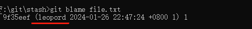

# 工作中常用的 git 操作

## commit 相关

### 查看 commit 历史

```shell
git log
```


### 修改上一个 commit

如果 commit 消息有错别字或者「暂存区」有改动，想把改动提交到上一个 commit。

```shell
git commit --amend
```


### 展示简化的 commit 历史

```shell
git log --pretty=oneline --graph --decorate --all
```


### 修改提交者信息

```shell
git commit --amend --author="Name <email>"
```


### 重设第一个 commit

也就是把所有的改动都重新放回「工作目录」，并清空所有的 commit，这样就可以重新提交第一个 commit 了

```shell
git update-ref -d HEAD
```


### 显示分支 A 有但是分支 B 没有的 commit 日志

```shell
git log A ^B
```

### 把 A 分支的某一个 commit，放到 B 分支上

需要用到 cherry-pick 命令

```shell
# 切换到B分支
git checkout B 

# 挑选A分支下的某个commit
git cherry-pick <commitId>
```


### 回到某个 commit 的状态，并删除后面的 commit

```shell
git reset <commit-id>  #默认就是-mixed参数。

git reset --mixed HEAD^  #回退至上个版本，它将重置HEAD到另外一个commit,并且重置「暂存区」以便和HEAD相匹配，但是也到此为止。「工作目录」不会被更改。

git reset --soft HEAD~3  #回退至三个版本之前，只回退了commit的信息，「暂存区」和「工作目录」与回退之前保持一致。如果还要提交，直接commit即可  

git reset --hard <commit-id>  #彻底回退到指定commit-id的状态，「暂存区」和「工作目录」也会变为指定commit-id版本的内容
```


## 标签相关

### 本地创建标签

```shell
git tag <tagName>
```

默认 tag 是打在最近的一次 commit 上，如果需要指定 commit 来打 tag：

```shell
git tag -a <tagName> -m "<description>" <commitId>
```


### 查看标签

```shell
git tag
```


### 展示当前分支的最近的 tag

```shell
git describe --tags --abbrev=0
```


### 查看标签详细信息

```shell
git tag -ln
```


### 删除本地标签

```shell
git tag -d <tagName>
```


### 删除远程标签

```shell
git push origin --delete tag <tagname>
```

### 切回到某个标签

一般上线之前都会打 tag，就是为了防止上线后出现问题，方便快速回退到上一版本。

下面的命令是回到某一标签下的状态：

```shell
git checkout -b <branchName> <tagName>
```


## 分支相关

### 创建并切换到本地分支

```shell
git checkout -b <branchName>
```


### 重命名本地分支

```shell
git branch -m <newBranchName>
```


### 删除本地分支

```shell
git branch -d <branchName>
```


### 列出所有远程分支

-r 参数相当于：remote

```shell
git branch -r
```


### 列出本地和远程分支

-a 参数相当于：all

```shell
git branch -a
```


### 展示本地分支关联远程仓库的情况

```shell
git branch -vv
```


### 关联远程分支

关联之后，git branch -vv 就可以展示关联的远程分支名了，同时推送到远程仓库直接：git push，不需要指定远程仓库了。

```shell
git branch -u origin/remoteBranch
```


或者在 push 时加上 -u 参数

```shell
git push origin/mybranch -u
```

### 查看远程分支和本地分支的对应关系

```shell
git remote show origin
```


### 远程删除了分支本地也想删除

```shell
git remote prune origin
```

远程仓库删除了 dev 分支，可以通过 git remote show origin 命令查看远程分支和本地分支的对应关系：


执行命令后只是删除了本地追踪分支（origin/dev）。

### 从远程分支中创建并切换到本地分支

```shell
git checkout -b <branch-name> origin/<branch-name>
```


### 删除远程分支

```shell
git push origin --delete <remote-branchName>
```


或者

```shell
git push origin <remote-branchName>
```

### 展示任意分支某一文件的内容

```shell
git show <branch-name>:<file-name>
```


### clone 下来指定的单一分支

```shell
git clone -b <branch-name> --single-branch https://xxx.git
```


## stash 相关

### 保存当前状态，包括 untracked 的文件

untracked 文件：新建的文件

```shell
git stash -u
```


### 展示所有 stashes

```shell
git stash list
```


### 回到某个 stash 的状态

```shell
git stash apply <stash@{n}>
```


### 回到最后一个 stash 的状态，并删除这个 stash

```shell
git stash pop
```

### 删除所有的 stash

```shell
git stash clear
```

### 从 stash 中拿出某个文件的修改

```shell
git checkout <stash@{n}> -- <file-path>
```


**只有添加进「暂存区」的文件才能使用这个命令，新建文件并不行**

## 其他

### 展示「暂存区」、「工作目录」和最近版本的不同

输出「工作目录」、「暂存区」和本地最近的版本 (commit) 的 different (不同)。

```shell
git diff HEAD
```


### 放弃「工作目录」的修改

```shell
git checkout <file-name>
```


### 放弃所有修改：

```shell
git checkout .
```


### 恢复删除的文件

```shell
git rev-list -n 1 HEAD -- <file_path> #输出新增该文件时的commit对象的hash值

git checkout <deleting_commit>^ -- <file_path> #从该commit对象取出文件
```


### 查看某段代码是谁写的

```shell
git blame <file-name>
```



### 显示本地更新过 HEAD 的 git 命令记录

每次更新了 HEAD 的 git 命令比如 commit、amend、cherry-pick、reset、revert 等都会被记录下来（不限分支），就像 shell 的 history 一样。 这样我们可以 reset 到任何一次更新了 HEAD 的操作之后，而不仅仅是回到当前分支下的某个 commit 之后的状态。

```shell
git reflog
```


### 增加远程仓库

```shell
git remote add <repoName> <remote-url>
```


### 修改远程仓库的 url

```shell
git remote set-url <repoName> <URL>
```


### 列出所有远程仓库

```shell
git remote
git remote -v
```


### 查看半个钟内的改动

```shell
git whatchanged --since="30 minutes ago"
```


### 展示「工作目录」和「暂存区」的不同

输出「工作目录」和「暂存区」的 different (不同)。

```shell
git diff
```


还可以展示本地仓库中任意两个 commit 之间的文件变动：

```shell
git diff <commitId> <commitId>
```


### 展示「暂存区」和最近版本的不同

输出「暂存区」和本地最近的版本 (commit) 的 different (不同)。

```shell
git diff --cached
```

### 查看冲突文件列表

展示「工作目录」中存在冲突文件的列表

```shell
git diff --name-only --diff-filter=U
```

