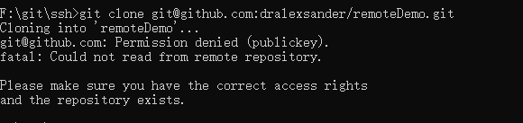
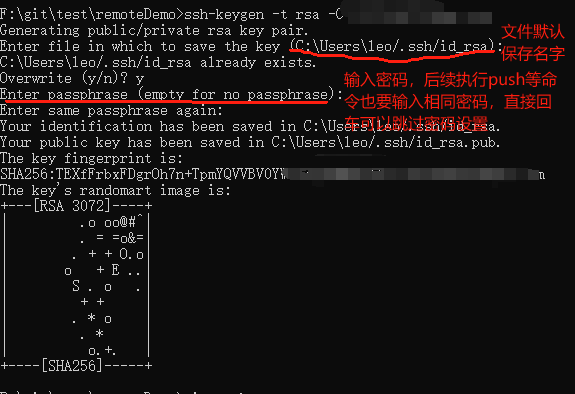
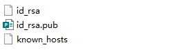
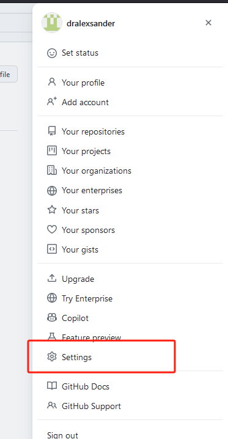
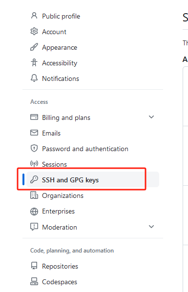
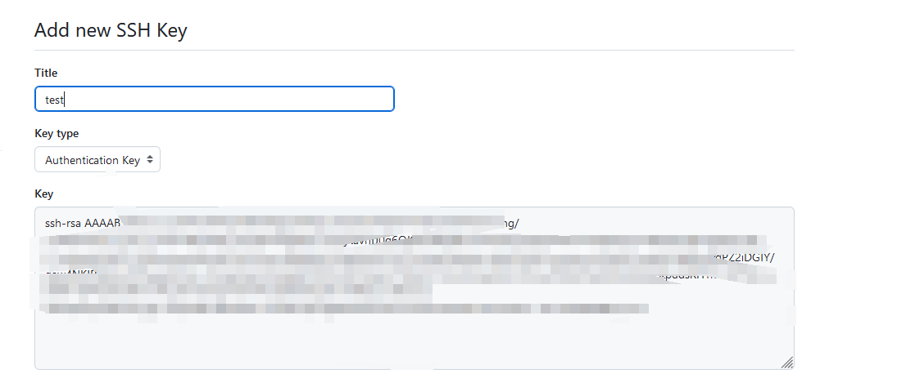
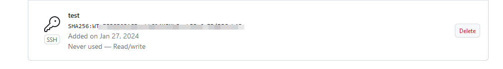
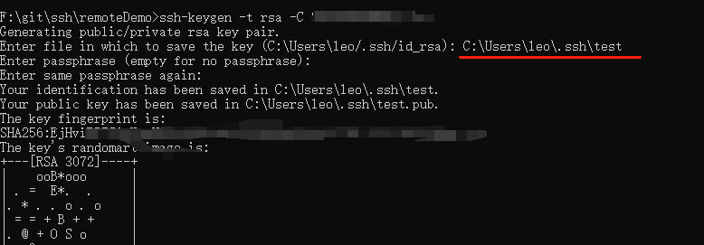
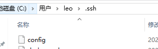
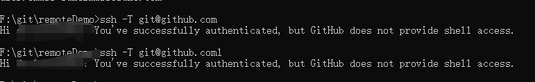

# ssh 配置

在管理Git项目上，很多时候都是直接使用 https url 克隆到本地，当然也有有些人使用 SSH url 克隆到本地。

这两种方式的主要区别在于：使用 https url 克隆对初学者来说会比较方便，复制 https url 然后到 git Bash 里面直接用 clone 命令克隆到本地就好了，但是每次 fetch 和 push 代码都需要输入账号和密码，这也是 https 方式的麻烦之处（当然现在已经可以把账号信息保存下来，不需要每次都输入，不过本文暂时不介绍这个）。

而使用 SSH url 克隆却需要在克隆之前先添加和配置好 SSH key，因此，如果我们想要使用 SSH url 克隆的话，我们必须是这个项目的拥有者。否则我们是无法添加 SSH key 的，另外 ssh 默认是每次 fetch 和 push 代码都不需要输入账号和密码，如果我们想要每次都输入账号密码才能进行 fetch 和 push 也可以另外进行设置。


本文主要是讲述如何配置和使用 ssh 方式来提交和克隆代码。

如果我们没有配置 ssh，我们并不能 clone 远程仓库。



## 配置账号信息

```shell
git config user.name <name>

git config user.email <email>
```

## 生成 ssh 公钥密钥

```shell
ssh-keygen -t rsa -C <email>
```



之后可以在对应的文件夹下看到生成的 ssh 配置文件：



- id_rsa：是秘钥，是本机的秘钥
- id_rsa.pub：是公钥，是需要在 GitHub 账户上面配置的

## 在 GitHub 上配置

登录 [GitHub](https://github.com)，点击右上角的头像：



点击侧边栏中的 SSH and GPG keys，



后点击绿色的 New SSH key 按钮进行配置，把上面生成的 id_rsa.pub 的文件内容复制粘贴到 key 里：



点击添加后就可以在列表中看到配置好的key，这时候就可以执行 clone 命令了。




**在不同电脑上使用同一个账号也需要重新生成 key 并在 github 上配置。**

## 配置多个 GitHub 账号

github使用SSH与客户端连接。如果是单用户（first），生成密钥对后，将公钥保存至github，
每次连接时SSH客户端发送本地私钥（默认~/.ssh/id_rsa）到服务端验证。

单用户情况下，连接的服务器上保存的公钥和发送的私钥自然是配对的。但如果是多个用户呢？

同样对于不同的账号，我们仍需要先执行 ssh-keygen -t rsa -C \<email> 命令生成 ssh key，不过这时候就需要注意要修改生成的文件名了，新密钥的文件名必须和第一个不一样，否则会覆盖掉原来的密钥文件。




**注意这个路径，如果是相对路径，那么就会在相对于当前的目录下生成这个key文件。**

将生成的 PUB 文件同样配置到 github 中，然后在 .ssh 文件夹中新建一个 config 文件。



在 config 文件中配置不同的账号信息：

比如：

```
Host github.com
HostName github.com
User git
PreferredAuthentications publickey
IdentityFile ~/.ssh/id_rsa

Host github.com1
HostName github.com
User git
PreferredAuthentications publickey
IdentityFile ~/.ssh/test
```

- Host 后面的名字是别名，对应不同的账号
- 其中 HostName 是 git 的域名，文章以 GitHub 为例，因此 HostName 是 github.com。
- User 都是 git
- PreferredAuthentications 照抄即可
- IdentityFile 就是存放密钥文件的位置

配置完成后需要测试一下 ssh 链接：

分别执行 `ssh -T git@github.com` 和  `ssh -T git@github.com1` 能否成功访问 GitHub.



之后如果我们要切换账户的就需要在 clone 或者 push 前修改 ssh url：

比如说 account1 对应了上面的 Host github.com，account2 对应了上面的 Host github.com1，从 account1 切换到 account2 的话就需要把 git@github.com 改成 git@github.com1 (通过 git remote set-url \<repoName> \<url> 命令更改，或者手动在 .git/config 文件里改)

**注意： GitHub根据配置文件的 user.email 来获取 GitHub 帐号显示 author 信息， 所以对于多帐号用户一定要记得将 user.email 改为相应的 email(account2@mail.com)**

